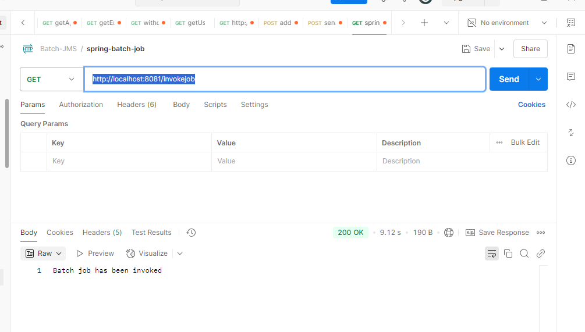
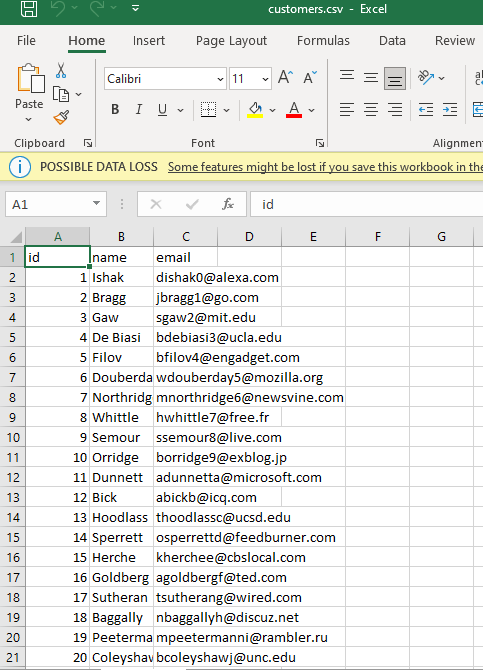

1) hit http://localhost:8081/invokejob
2) It will read all data from csv file and post them accordingly into
   correct column within the corresponding table
3) Console Log:
   "C:\Program Files\Java\jdk-17\bin\java.exe" -agentlib:jdwp=transport=dt_socket,address=127.0.0.1:53408,suspend=y,server=n -javaagent:C:\Users\LENOVO\AppData\Local\JetBrains\IdeaIC2024.2\captureAgent\debugger-agent.jar -Dkotlinx.coroutines.debug.enable.creation.stack.trace=false -Ddebugger.agent.enable.coroutines=true -Dfile.encoding=UTF-8 -classpath "C:\Users\LENOVO\IdeaProjects\spring-boot-batch\target\classes;C:\Users\LENOVO\.m2\repository\org\springframework\boot\spring-boot-starter-data-jpa\3.1.5\spring-boot-starter-data-jpa-3.1.5.jar;C:\Users\LENOVO\.m2\repository\org\springframework\boot\spring-boot-starter-aop\3.1.5\spring-boot-starter-aop-3.1.5.jar;C:\Users\LENOVO\.m2\repository\org\springframework\spring-aop\6.0.13\spring-aop-6.0.13.jar;C:\Users\LENOVO\.m2\repository\org\aspectj\aspectjweaver\1.9.20\aspectjweaver-1.9.20.jar;C:\Users\LENOVO\.m2\repository\org\springframework\boot\spring-boot-starter-jdbc\3.1.5\spring-boot-starter-jdbc-3.1.5.jar;C:\Users\LENOVO\.m2\repository\com\zaxxer\HikariCP\5.0.1\HikariCP-5.0.1.jar;C:\Users\LENOVO\.m2\repository\org\springframework\spring-jdbc\6.0.13\spring-jdbc-6.0.13.jar;C:\Users\LENOVO\.m2\repository\org\hibernate\orm\hibernate-core\6.2.13.Final\hibernate-core-6.2.13.Final.jar;C:\Users\LENOVO\.m2\repository\jakarta\persistence\jakarta.persistence-api\3.1.0\jakarta.persistence-api-3.1.0.jar;C:\Users\LENOVO\.m2\repository\jakarta\transaction\jakarta.transaction-api\2.0.1\jakarta.transaction-api-2.0.1.jar;C:\Users\LENOVO\.m2\repository\org\jboss\logging\jboss-logging\3.5.3.Final\jboss-logging-3.5.3.Final.jar;C:\Users\LENOVO\.m2\repository\org\hibernate\common\hibernate-commons-annotations\6.0.6.Final\hibernate-commons-annotations-6.0.6.Final.jar;C:\Users\LENOVO\.m2\repository\io\smallrye\jandex\3.0.5\jandex-3.0.5.jar;C:\Users\LENOVO\.m2\repository\com\fasterxml\classmate\1.5.1\classmate-1.5.1.jar;C:\Users\LENOVO\.m2\repository\net\bytebuddy\byte-buddy\1.14.9\byte-buddy-1.14.9.jar;C:\Users\LENOVO\.m2\repository\org\glassfish\jaxb\jaxb-runtime\4.0.3\jaxb-runtime-4.0.3.jar;C:\Users\LENOVO\.m2\repository\org\glassfish\jaxb\jaxb-core\4.0.3\jaxb-core-4.0.3.jar;C:\Users\LENOVO\.m2\repository\org\eclipse\angus\angus-activation\2.0.1\angus-activation-2.0.1.jar;C:\Users\LENOVO\.m2\repository\org\glassfish\jaxb\txw2\4.0.3\txw2-4.0.3.jar;C:\Users\LENOVO\.m2\repository\com\sun\istack\istack-commons-runtime\4.1.2\istack-commons-runtime-4.1.2.jar;C:\Users\LENOVO\.m2\repository\jakarta\inject\jakarta.inject-api\2.0.1\jakarta.inject-api-2.0.1.jar;C:\Users\LENOVO\.m2\repository\org\antlr\antlr4-runtime\4.10.1\antlr4-runtime-4.10.1.jar;C:\Users\LENOVO\.m2\repository\org\springframework\data\spring-data-jpa\3.1.5\spring-data-jpa-3.1.5.jar;C:\Users\LENOVO\.m2\repository\org\springframework\data\spring-data-commons\3.1.5\spring-data-commons-3.1.5.jar;C:\Users\LENOVO\.m2\repository\org\springframework\spring-orm\6.0.13\spring-orm-6.0.13.jar;C:\Users\LENOVO\.m2\repository\org\springframework\spring-context\6.0.13\spring-context-6.0.13.jar;C:\Users\LENOVO\.m2\repository\org\springframework\spring-tx\6.0.13\spring-tx-6.0.13.jar;C:\Users\LENOVO\.m2\repository\org\springframework\spring-beans\6.0.13\spring-beans-6.0.13.jar;C:\Users\LENOVO\.m2\repository\jakarta\annotation\jakarta.annotation-api\2.1.1\jakarta.annotation-api-2.1.1.jar;C:\Users\LENOVO\.m2\repository\org\slf4j\slf4j-api\2.0.9\slf4j-api-2.0.9.jar;C:\Users\LENOVO\.m2\repository\org\springframework\spring-aspects\6.0.13\spring-aspects-6.0.13.jar;C:\Users\LENOVO\.m2\repository\org\springframework\boot\spring-boot-starter-web\3.1.5\spring-boot-starter-web-3.1.5.jar;C:\Users\LENOVO\.m2\repository\org\springframework\boot\spring-boot-starter\3.1.5\spring-boot-starter-3.1.5.jar;C:\Users\LENOVO\.m2\repository\org\springframework\boot\spring-boot\3.1.5\spring-boot-3.1.5.jar;C:\Users\LENOVO\.m2\repository\org\springframework\boot\spring-boot-autoconfigure\3.1.5\spring-boot-autoconfigure-3.1.5.jar;C:\Users\LENOVO\.m2\repository\org\springframework\boot\spring-boot-starter-logging\3.1.5\spring-boot-starter-logging-3.1.5.jar;C:\Users\LENOVO\.m2\repository\ch\qos\logback\logback-classic\1.4.11\logback-classic-1.4.11.jar;C:\Users\LENOVO\.m2\repository\ch\qos\logback\logback-core\1.4.11\logback-core-1.4.11.jar;C:\Users\LENOVO\.m2\repository\org\apache\logging\log4j\log4j-to-slf4j\2.20.0\log4j-to-slf4j-2.20.0.jar;C:\Users\LENOVO\.m2\repository\org\apache\logging\log4j\log4j-api\2.20.0\log4j-api-2.20.0.jar;C:\Users\LENOVO\.m2\repository\org\slf4j\jul-to-slf4j\2.0.9\jul-to-slf4j-2.0.9.jar;C:\Users\LENOVO\.m2\repository\org\yaml\snakeyaml\1.33\snakeyaml-1.33.jar;C:\Users\LENOVO\.m2\repository\org\springframework\boot\spring-boot-starter-json\3.1.5\spring-boot-starter-json-3.1.5.jar;C:\Users\LENOVO\.m2\repository\com\fasterxml\jackson\core\jackson-databind\2.15.3\jackson-databind-2.15.3.jar;C:\Users\LENOVO\.m2\repository\com\fasterxml\jackson\core\jackson-annotations\2.15.3\jackson-annotations-2.15.3.jar;C:\Users\LENOVO\.m2\repository\com\fasterxml\jackson\core\jackson-core\2.15.3\jackson-core-2.15.3.jar;C:\Users\LENOVO\.m2\repository\com\fasterxml\jackson\datatype\jackson-datatype-jdk8\2.15.3\jackson-datatype-jdk8-2.15.3.jar;C:\Users\LENOVO\.m2\repository\com\fasterxml\jackson\datatype\jackson-datatype-jsr310\2.15.3\jackson-datatype-jsr310-2.15.3.jar;C:\Users\LENOVO\.m2\repository\com\fasterxml\jackson\module\jackson-module-parameter-names\2.15.3\jackson-module-parameter-names-2.15.3.jar;C:\Users\LENOVO\.m2\repository\org\springframework\boot\spring-boot-starter-tomcat\3.1.5\spring-boot-starter-tomcat-3.1.5.jar;C:\Users\LENOVO\.m2\repository\org\apache\tomcat\embed\tomcat-embed-core\10.1.15\tomcat-embed-core-10.1.15.jar;C:\Users\LENOVO\.m2\repository\org\apache\tomcat\embed\tomcat-embed-el\10.1.15\tomcat-embed-el-10.1.15.jar;C:\Users\LENOVO\.m2\repository\org\apache\tomcat\embed\tomcat-embed-websocket\10.1.15\tomcat-embed-websocket-10.1.15.jar;C:\Users\LENOVO\.m2\repository\org\springframework\spring-web\6.0.13\spring-web-6.0.13.jar;C:\Users\LENOVO\.m2\repository\org\springframework\spring-webmvc\6.0.13\spring-webmvc-6.0.13.jar;C:\Users\LENOVO\.m2\repository\org\springframework\spring-expression\6.0.13\spring-expression-6.0.13.jar;C:\Users\LENOVO\.m2\repository\com\microsoft\sqlserver\mssql-jdbc\11.2.3.jre17\mssql-jdbc-11.2.3.jre17.jar;C:\Users\LENOVO\.m2\repository\com\h2database\h2\2.1.214\h2-2.1.214.jar;C:\Users\LENOVO\.m2\repository\jakarta\xml\bind\jakarta.xml.bind-api\4.0.1\jakarta.xml.bind-api-4.0.1.jar;C:\Users\LENOVO\.m2\repository\jakarta\activation\jakarta.activation-api\2.1.2\jakarta.activation-api-2.1.2.jar;C:\Users\LENOVO\.m2\repository\org\springframework\spring-core\6.0.13\spring-core-6.0.13.jar;C:\Users\LENOVO\.m2\repository\org\springframework\spring-jcl\6.0.13\spring-jcl-6.0.13.jar;C:\Users\LENOVO\.m2\repository\org\projectlombok\lombok\1.18.30\lombok-1.18.30.jar;C:\Users\LENOVO\.m2\repository\org\springframework\boot\spring-boot-starter-batch\3.1.5\spring-boot-starter-batch-3.1.5.jar;C:\Users\LENOVO\.m2\repository\org\springframework\batch\spring-batch-core\5.0.3\spring-batch-core-5.0.3.jar;C:\Users\LENOVO\.m2\repository\org\springframework\batch\spring-batch-infrastructure\5.0.3\spring-batch-infrastructure-5.0.3.jar;C:\Users\LENOVO\.m2\repository\org\springframework\retry\spring-retry\2.0.4\spring-retry-2.0.4.jar;C:\Users\LENOVO\.m2\repository\io\micrometer\micrometer-registry-prometheus\1.11.5\micrometer-registry-prometheus-1.11.5.jar;C:\Users\LENOVO\.m2\repository\io\micrometer\micrometer-core\1.11.5\micrometer-core-1.11.5.jar;C:\Users\LENOVO\.m2\repository\io\micrometer\micrometer-commons\1.11.5\micrometer-commons-1.11.5.jar;C:\Users\LENOVO\.m2\repository\org\hdrhistogram\HdrHistogram\2.1.12\HdrHistogram-2.1.12.jar;C:\Users\LENOVO\.m2\repository\org\latencyutils\LatencyUtils\2.0.3\LatencyUtils-2.0.3.jar;C:\Users\LENOVO\.m2\repository\io\prometheus\simpleclient_common\0.16.0\simpleclient_common-0.16.0.jar;C:\Users\LENOVO\.m2\repository\io\prometheus\simpleclient\0.16.0\simpleclient-0.16.0.jar;C:\Users\LENOVO\.m2\repository\io\prometheus\simpleclient_tracer_otel\0.16.0\simpleclient_tracer_otel-0.16.0.jar;C:\Users\LENOVO\.m2\repository\io\prometheus\simpleclient_tracer_common\0.16.0\simpleclient_tracer_common-0.16.0.jar;C:\Users\LENOVO\.m2\repository\io\prometheus\simpleclient_tracer_otel_agent\0.16.0\simpleclient_tracer_otel_agent-0.16.0.jar;C:\Users\LENOVO\.m2\repository\org\springframework\boot\spring-boot-starter-actuator\3.1.5\spring-boot-starter-actuator-3.1.5.jar;C:\Users\LENOVO\.m2\repository\org\springframework\boot\spring-boot-actuator-autoconfigure\3.1.5\spring-boot-actuator-autoconfigure-3.1.5.jar;C:\Users\LENOVO\.m2\repository\org\springframework\boot\spring-boot-actuator\3.1.5\spring-boot-actuator-3.1.5.jar;C:\Users\LENOVO\.m2\repository\io\micrometer\micrometer-observation\1.11.5\micrometer-observation-1.11.5.jar;C:\Program Files\JetBrains\IntelliJ IDEA Community Edition 2024.2.3\lib\idea_rt.jar" org.sb.batch.poc.app.Application
   Connected to the target VM, address: '127.0.0.1:53408', transport: 'socket'

.   ____          _            __ _ _
/\\ / ___'_ __ _ _(_)_ __  __ _ \ \ \ \
( ( )\___ | '_ | '_| | '_ \/ _` | \ \ \ \
\\/  ___)| |_)| | | | | || (_| |  ) ) ) )
'  |____| .__|_| |_|_| |_\__, | / / / /
=========|_|==============|___/=/_/_/_/
:: Spring Boot ::                (v3.1.5)

2025-02-13T01:54:06.023+05:30  INFO 13036 --- [           main] org.sb.batch.poc.app.Application         : Starting Application using Java 17.0.12 with PID 13036 (C:\Users\LENOVO\IdeaProjects\spring-boot-batch\target\classes started by LENOVO in C:\Users\LENOVO\IdeaProjects\spring-boot-batch)
2025-02-13T01:54:06.034+05:30  INFO 13036 --- [           main] org.sb.batch.poc.app.Application         : No active profile set, falling back to 1 default profile: "default"
2025-02-13T01:54:11.577+05:30  INFO 13036 --- [           main] .s.d.r.c.RepositoryConfigurationDelegate : Bootstrapping Spring Data JPA repositories in DEFAULT mode.
2025-02-13T01:54:12.291+05:30  INFO 13036 --- [           main] .s.d.r.c.RepositoryConfigurationDelegate : Finished Spring Data repository scanning in 664 ms. Found 1 JPA repository interfaces.
2025-02-13T01:54:15.749+05:30  INFO 13036 --- [           main] o.s.b.w.embedded.tomcat.TomcatWebServer  : Tomcat initialized with port(s): 8081 (http)
2025-02-13T01:54:15.814+05:30  INFO 13036 --- [           main] o.apache.catalina.core.StandardService   : Starting service [Tomcat]
2025-02-13T01:54:15.815+05:30  INFO 13036 --- [           main] o.apache.catalina.core.StandardEngine    : Starting Servlet engine: [Apache Tomcat/10.1.15]
2025-02-13T01:54:16.383+05:30  INFO 13036 --- [           main] o.a.c.c.C.[Tomcat].[localhost].[/]       : Initializing Spring embedded WebApplicationContext
2025-02-13T01:54:16.390+05:30  INFO 13036 --- [           main] w.s.c.ServletWebServerApplicationContext : Root WebApplicationContext: initialization completed in 10075 ms
2025-02-13T01:54:18.006+05:30  INFO 13036 --- [           main] com.zaxxer.hikari.HikariDataSource       : HikariPool-1 - Starting...
2025-02-13T01:54:20.364+05:30  INFO 13036 --- [           main] com.zaxxer.hikari.pool.HikariPool        : HikariPool-1 - Added connection ConnectionID:1 ClientConnectionId: 07cd7c88-7e36-478a-b406-57962e6f902c
2025-02-13T01:54:20.377+05:30  INFO 13036 --- [           main] com.zaxxer.hikari.HikariDataSource       : HikariPool-1 - Start completed.
2025-02-13T01:54:21.089+05:30  INFO 13036 --- [           main] o.hibernate.jpa.internal.util.LogHelper  : HHH000204: Processing PersistenceUnitInfo [name: default]
2025-02-13T01:54:21.401+05:30  INFO 13036 --- [           main] org.hibernate.Version                    : HHH000412: Hibernate ORM core version 6.2.13.Final
2025-02-13T01:54:21.411+05:30  INFO 13036 --- [           main] org.hibernate.cfg.Environment            : HHH000406: Using bytecode reflection optimizer
2025-02-13T01:54:23.946+05:30  INFO 13036 --- [           main] o.s.o.j.p.SpringPersistenceUnitInfo      : No LoadTimeWeaver setup: ignoring JPA class transformer
2025-02-13T01:54:24.247+05:30  WARN 13036 --- [           main] org.hibernate.orm.deprecation            : HHH90000025: SQLServerDialect does not need to be specified explicitly using 'hibernate.dialect' (remove the property setting and it will be selected by default)
2025-02-13T01:54:28.804+05:30  INFO 13036 --- [           main] o.h.e.t.j.p.i.JtaPlatformInitiator       : HHH000489: No JTA platform available (set 'hibernate.transaction.jta.platform' to enable JTA platform integration)
Hibernate: create table customers_info (customer_id int not null, email varchar(255), full_name varchar(255), primary key (customer_id))
2025-02-13T01:54:30.095+05:30  WARN 13036 --- [           main] o.h.t.s.i.ExceptionHandlerLoggedImpl     : GenerationTarget encountered exception accepting command : Error executing DDL "create table customers_info (customer_id int not null, email varchar(255), full_name varchar(255), primary key (customer_id))" via JDBC [There is already an object named 'customers_info' in the database.]

org.hibernate.tool.schema.spi.CommandAcceptanceException: Error executing DDL "create table customers_info (customer_id int not null, email varchar(255), full_name varchar(255), primary key (customer_id))" via JDBC [There is already an object named 'customers_info' in the database.]
at org.hibernate.tool.schema.internal.exec.GenerationTargetToDatabase.accept(GenerationTargetToDatabase.java:94) ~[hibernate-core-6.2.13.Final.jar:6.2.13.Final]
at org.hibernate.tool.schema.internal.AbstractSchemaMigrator.applySqlString(AbstractSchemaMigrator.java:574) ~[hibernate-core-6.2.13.Final.jar:6.2.13.Final]
at org.hibernate.tool.schema.internal.AbstractSchemaMigrator.applySqlStrings(AbstractSchemaMigrator.java:514) ~[hibernate-core-6.2.13.Final.jar:6.2.13.Final]
at org.hibernate.tool.schema.internal.AbstractSchemaMigrator.createTable(AbstractSchemaMigrator.java:315) ~[hibernate-core-6.2.13.Final.jar:6.2.13.Final]
at org.hibernate.tool.schema.internal.GroupedSchemaMigratorImpl.performTablesMigration(GroupedSchemaMigratorImpl.java:80) ~[hibernate-core-6.2.13.Final.jar:6.2.13.Final]
at org.hibernate.tool.schema.internal.AbstractSchemaMigrator.performMigration(AbstractSchemaMigrator.java:232) ~[hibernate-core-6.2.13.Final.jar:6.2.13.Final]
at org.hibernate.tool.schema.internal.AbstractSchemaMigrator.doMigration(AbstractSchemaMigrator.java:117) ~[hibernate-core-6.2.13.Final.jar:6.2.13.Final]
at org.hibernate.tool.schema.spi.SchemaManagementToolCoordinator.performDatabaseAction(SchemaManagementToolCoordinator.java:284) ~[hibernate-core-6.2.13.Final.jar:6.2.13.Final]
at org.hibernate.tool.schema.spi.SchemaManagementToolCoordinator.lambda$process$5(SchemaManagementToolCoordinator.java:143) ~[hibernate-core-6.2.13.Final.jar:6.2.13.Final]
at java.base/java.util.HashMap.forEach(HashMap.java:1421) ~[na:na]
at org.hibernate.tool.schema.spi.SchemaManagementToolCoordinator.process(SchemaManagementToolCoordinator.java:140) ~[hibernate-core-6.2.13.Final.jar:6.2.13.Final]
at org.hibernate.boot.internal.SessionFactoryObserverForSchemaExport.sessionFactoryCreated(SessionFactoryObserverForSchemaExport.java:37) ~[hibernate-core-6.2.13.Final.jar:6.2.13.Final]
at org.hibernate.internal.SessionFactoryObserverChain.sessionFactoryCreated(SessionFactoryObserverChain.java:35) ~[hibernate-core-6.2.13.Final.jar:6.2.13.Final]
at org.hibernate.internal.SessionFactoryImpl.<init>(SessionFactoryImpl.java:293) ~[hibernate-core-6.2.13.Final.jar:6.2.13.Final]
at org.hibernate.boot.internal.SessionFactoryBuilderImpl.build(SessionFactoryBuilderImpl.java:444) ~[hibernate-core-6.2.13.Final.jar:6.2.13.Final]
at org.hibernate.jpa.boot.internal.EntityManagerFactoryBuilderImpl.build(EntityManagerFactoryBuilderImpl.java:1458) ~[hibernate-core-6.2.13.Final.jar:6.2.13.Final]
at org.springframework.orm.jpa.vendor.SpringHibernateJpaPersistenceProvider.createContainerEntityManagerFactory(SpringHibernateJpaPersistenceProvider.java:75) ~[spring-orm-6.0.13.jar:6.0.13]
at org.springframework.orm.jpa.LocalContainerEntityManagerFactoryBean.createNativeEntityManagerFactory(LocalContainerEntityManagerFactoryBean.java:376) ~[spring-orm-6.0.13.jar:6.0.13]
at org.springframework.orm.jpa.AbstractEntityManagerFactoryBean.buildNativeEntityManagerFactory(AbstractEntityManagerFactoryBean.java:409) ~[spring-orm-6.0.13.jar:6.0.13]
at org.springframework.orm.jpa.AbstractEntityManagerFactoryBean.afterPropertiesSet(AbstractEntityManagerFactoryBean.java:396) ~[spring-orm-6.0.13.jar:6.0.13]
at org.springframework.orm.jpa.LocalContainerEntityManagerFactoryBean.afterPropertiesSet(LocalContainerEntityManagerFactoryBean.java:352) ~[spring-orm-6.0.13.jar:6.0.13]
at org.springframework.beans.factory.support.AbstractAutowireCapableBeanFactory.invokeInitMethods(AbstractAutowireCapableBeanFactory.java:1817) ~[spring-beans-6.0.13.jar:6.0.13]
at org.springframework.beans.factory.support.AbstractAutowireCapableBeanFactory.initializeBean(AbstractAutowireCapableBeanFactory.java:1766) ~[spring-beans-6.0.13.jar:6.0.13]
at org.springframework.beans.factory.support.AbstractAutowireCapableBeanFactory.doCreateBean(AbstractAutowireCapableBeanFactory.java:598) ~[spring-beans-6.0.13.jar:6.0.13]
at org.springframework.beans.factory.support.AbstractAutowireCapableBeanFactory.createBean(AbstractAutowireCapableBeanFactory.java:520) ~[spring-beans-6.0.13.jar:6.0.13]
at org.springframework.beans.factory.support.AbstractBeanFactory.lambda$doGetBean$0(AbstractBeanFactory.java:325) ~[spring-beans-6.0.13.jar:6.0.13]
at org.springframework.beans.factory.support.DefaultSingletonBeanRegistry.getSingleton(DefaultSingletonBeanRegistry.java:234) ~[spring-beans-6.0.13.jar:6.0.13]
at org.springframework.beans.factory.support.AbstractBeanFactory.doGetBean(AbstractBeanFactory.java:323) ~[spring-beans-6.0.13.jar:6.0.13]
at org.springframework.beans.factory.support.AbstractBeanFactory.getBean(AbstractBeanFactory.java:199) ~[spring-beans-6.0.13.jar:6.0.13]
at org.springframework.context.support.AbstractApplicationContext.getBean(AbstractApplicationContext.java:1166) ~[spring-context-6.0.13.jar:6.0.13]
at org.springframework.context.support.AbstractApplicationContext.finishBeanFactoryInitialization(AbstractApplicationContext.java:940) ~[spring-context-6.0.13.jar:6.0.13]
at org.springframework.context.support.AbstractApplicationContext.refresh(AbstractApplicationContext.java:616) ~[spring-context-6.0.13.jar:6.0.13]
at org.springframework.boot.web.servlet.context.ServletWebServerApplicationContext.refresh(ServletWebServerApplicationContext.java:146) ~[spring-boot-3.1.5.jar:3.1.5]
at org.springframework.boot.SpringApplication.refresh(SpringApplication.java:738) ~[spring-boot-3.1.5.jar:3.1.5]
at org.springframework.boot.SpringApplication.refreshContext(SpringApplication.java:440) ~[spring-boot-3.1.5.jar:3.1.5]
at org.springframework.boot.SpringApplication.run(SpringApplication.java:316) ~[spring-boot-3.1.5.jar:3.1.5]
at org.springframework.boot.SpringApplication.run(SpringApplication.java:1306) ~[spring-boot-3.1.5.jar:3.1.5]
at org.springframework.boot.SpringApplication.run(SpringApplication.java:1295) ~[spring-boot-3.1.5.jar:3.1.5]
at org.sb.batch.poc.app.Application.main(Application.java:9) ~[classes/:na]
Caused by: com.microsoft.sqlserver.jdbc.SQLServerException: There is already an object named 'customers_info' in the database.
at com.microsoft.sqlserver.jdbc.SQLServerException.makeFromDatabaseError(SQLServerException.java:265) ~[mssql-jdbc-11.2.3.jre17.jar:na]
at com.microsoft.sqlserver.jdbc.SQLServerStatement.getNextResult(SQLServerStatement.java:1676) ~[mssql-jdbc-11.2.3.jre17.jar:na]
at com.microsoft.sqlserver.jdbc.SQLServerStatement.doExecuteStatement(SQLServerStatement.java:907) ~[mssql-jdbc-11.2.3.jre17.jar:na]
at com.microsoft.sqlserver.jdbc.SQLServerStatement$StmtExecCmd.doExecute(SQLServerStatement.java:802) ~[mssql-jdbc-11.2.3.jre17.jar:na]
at com.microsoft.sqlserver.jdbc.TDSCommand.execute(IOBuffer.java:7620) ~[mssql-jdbc-11.2.3.jre17.jar:na]
at com.microsoft.sqlserver.jdbc.SQLServerConnection.executeCommand(SQLServerConnection.java:3916) ~[mssql-jdbc-11.2.3.jre17.jar:na]
at com.microsoft.sqlserver.jdbc.SQLServerStatement.executeCommand(SQLServerStatement.java:268) ~[mssql-jdbc-11.2.3.jre17.jar:na]
at com.microsoft.sqlserver.jdbc.SQLServerStatement.executeStatement(SQLServerStatement.java:242) ~[mssql-jdbc-11.2.3.jre17.jar:na]
at com.microsoft.sqlserver.jdbc.SQLServerStatement.execute(SQLServerStatement.java:775) ~[mssql-jdbc-11.2.3.jre17.jar:na]
at com.zaxxer.hikari.pool.ProxyStatement.execute(ProxyStatement.java:94) ~[HikariCP-5.0.1.jar:na]
at com.zaxxer.hikari.pool.HikariProxyStatement.execute(HikariProxyStatement.java) ~[HikariCP-5.0.1.jar:na]
at org.hibernate.tool.schema.internal.exec.GenerationTargetToDatabase.accept(GenerationTargetToDatabase.java:80) ~[hibernate-core-6.2.13.Final.jar:6.2.13.Final]
... 38 common frames omitted

2025-02-13T01:54:30.127+05:30  INFO 13036 --- [           main] j.LocalContainerEntityManagerFactoryBean : Initialized JPA EntityManagerFactory for persistence unit 'default'
2025-02-13T01:57:10.915+05:30  WARN 13036 --- [l-1 housekeeper] com.zaxxer.hikari.pool.HikariPool        : HikariPool-1 - Thread starvation or clock leap detected (housekeeper delta=2m50s433ms209µs900ns).
2025-02-13T01:57:13.694+05:30  WARN 13036 --- [           main] JpaBaseConfiguration$JpaWebConfiguration : spring.jpa.open-in-view is enabled by default. Therefore, database queries may be performed during view rendering. Explicitly configure spring.jpa.open-in-view to disable this warning
2025-02-13T01:57:15.581+05:30  INFO 13036 --- [           main] o.s.b.a.e.web.EndpointLinksResolver      : Exposing 1 endpoint(s) beneath base path '/actuator'
2025-02-13T01:57:15.926+05:30  INFO 13036 --- [           main] o.s.b.w.embedded.tomcat.TomcatWebServer  : Tomcat started on port(s): 8081 (http) with context path ''
2025-02-13T01:57:15.997+05:30  INFO 13036 --- [           main] org.sb.batch.poc.app.Application         : Started Application in 191.79 seconds (process running for 193.544)
2025-02-13T01:57:20.270+05:30  INFO 13036 --- [nio-8081-exec-1] o.a.c.c.C.[Tomcat].[localhost].[/]       : Initializing Spring DispatcherServlet 'dispatcherServlet'
2025-02-13T01:57:20.271+05:30  INFO 13036 --- [nio-8081-exec-1] o.s.web.servlet.DispatcherServlet        : Initializing Servlet 'dispatcherServlet'
2025-02-13T01:57:20.275+05:30  INFO 13036 --- [nio-8081-exec-1] o.s.web.servlet.DispatcherServlet        : Completed initialization in 3 ms
2025-02-13T01:57:20.612+05:30  INFO 13036 --- [nio-8081-exec-1] o.s.b.c.l.support.SimpleJobLauncher      : Job: [FlowJob: [name=csv-job]] launched with the following parameters: [{'startAt':'{value=1739392040411, type=class java.lang.Long, identifying=true}'}]
2025-02-13T01:57:20.762+05:30  INFO 13036 --- [nio-8081-exec-1] o.s.batch.core.job.SimpleStepHandler     : Executing step: [csv-step]
Hibernate: insert into customers_info (email,full_name,customer_id) values (?,?,?)
Hibernate: insert into customers_info (email,full_name,customer_id) values (?,?,?)
Hibernate: insert into customers_info (email,full_name,customer_id) values (?,?,?)
Hibernate: insert into customers_info (email,full_name,customer_id) values (?,?,?)
Hibernate: insert into customers_info (email,full_name,customer_id) values (?,?,?)
Hibernate: insert into customers_info (email,full_name,customer_id) values (?,?,?)
Hibernate: insert into customers_info (email,full_name,customer_id) values (?,?,?)
Hibernate: insert into customers_info (email,full_name,customer_id) values (?,?,?)
Hibernate: insert into customers_info (email,full_name,customer_id) values (?,?,?)
Hibernate: insert into customers_info (email,full_name,customer_id) values (?,?,?)
Hibernate: insert into customers_info (email,full_name,customer_id) values (?,?,?)
Hibernate: insert into customers_info (email,full_name,customer_id) values (?,?,?)
Hibernate: insert into customers_info (email,full_name,customer_id) values (?,?,?)
Hibernate: insert into customers_info (email,full_name,customer_id) values (?,?,?)
Hibernate: insert into customers_info (email,full_name,customer_id) values (?,?,?)
Hibernate: insert into customers_info (email,full_name,customer_id) values (?,?,?)
Hibernate: insert into customers_info (email,full_name,customer_id) values (?,?,?)
Hibernate: insert into customers_info (email,full_name,customer_id) values (?,?,?)
Hibernate: insert into customers_info (email,full_name,customer_id) values (?,?,?)
Hibernate: insert into customers_info (email,full_name,customer_id) values (?,?,?)
Hibernate: insert into customers_info (email,full_name,customer_id) values (?,?,?)
Hibernate: insert into customers_info (email,full_name,customer_id) values (?,?,?)
Hibernate: insert into customers_info (email,full_name,customer_id) values (?,?,?)
Hibernate: insert into customers_info (email,full_name,customer_id) values (?,?,?)
Hibernate: insert into customers_info (email,full_name,customer_id) values (?,?,?)
Hibernate: insert into customers_info (email,full_name,customer_id) values (?,?,?)
Hibernate: insert into customers_info (email,full_name,customer_id) values (?,?,?)
Hibernate: insert into customers_info (email,full_name,customer_id) values (?,?,?)
Hibernate: insert into customers_info (email,full_name,customer_id) values (?,?,?)
Hibernate: insert into customers_info (email,full_name,customer_id) values (?,?,?)
Hibernate: insert into customers_info (email,full_name,customer_id) values (?,?,?)
Hibernate: insert into customers_info (email,full_name,customer_id) values (?,?,?)
Hibernate: insert into customers_info (email,full_name,customer_id) values (?,?,?)
Hibernate: insert into customers_info (email,full_name,customer_id) values (?,?,?)
Hibernate: insert into customers_info (email,full_name,customer_id) values (?,?,?)
Hibernate: insert into customers_info (email,full_name,customer_id) values (?,?,?)
Hibernate: insert into customers_info (email,full_name,customer_id) values (?,?,?)
Hibernate: insert into customers_info (email,full_name,customer_id) values (?,?,?)
Hibernate: insert into customers_info (email,full_name,customer_id) values (?,?,?)
Hibernate: insert into customers_info (email,full_name,customer_id) values (?,?,?)
Hibernate: insert into customers_info (email,full_name,customer_id) values (?,?,?)
Hibernate: insert into customers_info (email,full_name,customer_id) values (?,?,?)
Hibernate: insert into customers_info (email,full_name,customer_id) values (?,?,?)
Hibernate: insert into customers_info (email,full_name,customer_id) values (?,?,?)
Hibernate: insert into customers_info (email,full_name,customer_id) values (?,?,?)
Hibernate: insert into customers_info (email,full_name,customer_id) values (?,?,?)
Hibernate: insert into customers_info (email,full_name,customer_id) values (?,?,?)
Hibernate: insert into customers_info (email,full_name,customer_id) values (?,?,?)
Hibernate: insert into customers_info (email,full_name,customer_id) values (?,?,?)
Hibernate: insert into customers_info (email,full_name,customer_id) values (?,?,?)
Hibernate: insert into customers_info (email,full_name,customer_id) values (?,?,?)
Hibernate: insert into customers_info (email,full_name,customer_id) values (?,?,?)
Hibernate: insert into customers_info (email,full_name,customer_id) values (?,?,?)
Hibernate: insert into customers_info (email,full_name,customer_id) values (?,?,?)
Hibernate: insert into customers_info (email,full_name,customer_id) values (?,?,?)
Hibernate: insert into customers_info (email,full_name,customer_id) values (?,?,?)
Hibernate: insert into customers_info (email,full_name,customer_id) values (?,?,?)
Hibernate: insert into customers_info (email,full_name,customer_id) values (?,?,?)
Hibernate: insert into customers_info (email,full_name,customer_id) values (?,?,?)
Hibernate: insert into customers_info (email,full_name,customer_id) values (?,?,?)
Hibernate: insert into customers_info (email,full_name,customer_id) values (?,?,?)
Hibernate: insert into customers_info (email,full_name,customer_id) values (?,?,?)
Hibernate: insert into customers_info (email,full_name,customer_id) values (?,?,?)
Hibernate: insert into customers_info (email,full_name,customer_id) values (?,?,?)
Hibernate: insert into customers_info (email,full_name,customer_id) values (?,?,?)
Hibernate: insert into customers_info (email,full_name,customer_id) values (?,?,?)
Hibernate: insert into customers_info (email,full_name,customer_id) values (?,?,?)
Hibernate: insert into customers_info (email,full_name,customer_id) values (?,?,?)
Hibernate: insert into customers_info (email,full_name,customer_id) values (?,?,?)
Hibernate: insert into customers_info (email,full_name,customer_id) values (?,?,?)
Hibernate: insert into customers_info (email,full_name,customer_id) values (?,?,?)
Hibernate: insert into customers_info (email,full_name,customer_id) values (?,?,?)
Hibernate: insert into customers_info (email,full_name,customer_id) values (?,?,?)
Hibernate: insert into customers_info (email,full_name,customer_id) values (?,?,?)
Hibernate: insert into customers_info (email,full_name,customer_id) values (?,?,?)
Hibernate: insert into customers_info (email,full_name,customer_id) values (?,?,?)
Hibernate: insert into customers_info (email,full_name,customer_id) values (?,?,?)
Hibernate: insert into customers_info (email,full_name,customer_id) values (?,?,?)
Hibernate: insert into customers_info (email,full_name,customer_id) values (?,?,?)
Hibernate: insert into customers_info (email,full_name,customer_id) values (?,?,?)
Hibernate: insert into customers_info (email,full_name,customer_id) values (?,?,?)
Hibernate: insert into customers_info (email,full_name,customer_id) values (?,?,?)
Hibernate: insert into customers_info (email,full_name,customer_id) values (?,?,?)
Hibernate: insert into customers_info (email,full_name,customer_id) values (?,?,?)
Hibernate: insert into customers_info (email,full_name,customer_id) values (?,?,?)
Hibernate: insert into customers_info (email,full_name,customer_id) values (?,?,?)
Hibernate: insert into customers_info (email,full_name,customer_id) values (?,?,?)
Hibernate: insert into customers_info (email,full_name,customer_id) values (?,?,?)
Hibernate: insert into customers_info (email,full_name,customer_id) values (?,?,?)
Hibernate: insert into customers_info (email,full_name,customer_id) values (?,?,?)
Hibernate: insert into customers_info (email,full_name,customer_id) values (?,?,?)
Hibernate: insert into customers_info (email,full_name,customer_id) values (?,?,?)
Hibernate: insert into customers_info (email,full_name,customer_id) values (?,?,?)
Hibernate: insert into customers_info (email,full_name,customer_id) values (?,?,?)
Hibernate: insert into customers_info (email,full_name,customer_id) values (?,?,?)
Hibernate: insert into customers_info (email,full_name,customer_id) values (?,?,?)
Hibernate: insert into customers_info (email,full_name,customer_id) values (?,?,?)
Hibernate: insert into customers_info (email,full_name,customer_id) values (?,?,?)
Hibernate: insert into customers_info (email,full_name,customer_id) values (?,?,?)
Hibernate: insert into customers_info (email,full_name,customer_id) values (?,?,?)
Hibernate: insert into customers_info (email,full_name,customer_id) values (?,?,?)
Hibernate: insert into customers_info (email,full_name,customer_id) values (?,?,?)
Hibernate: insert into customers_info (email,full_name,customer_id) values (?,?,?)
Hibernate: insert into customers_info (email,full_name,customer_id) values (?,?,?)
Hibernate: insert into customers_info (email,full_name,customer_id) values (?,?,?)
Hibernate: insert into customers_info (email,full_name,customer_id) values (?,?,?)
Hibernate: insert into customers_info (email,full_name,customer_id) values (?,?,?)
Hibernate: insert into customers_info (email,full_name,customer_id) values (?,?,?)
Hibernate: insert into customers_info (email,full_name,customer_id) values (?,?,?)
Hibernate: insert into customers_info (email,full_name,customer_id) values (?,?,?)
Hibernate: insert into customers_info (email,full_name,customer_id) values (?,?,?)
Hibernate: insert into customers_info (email,full_name,customer_id) values (?,?,?)
Hibernate: insert into customers_info (email,full_name,customer_id) values (?,?,?)
Hibernate: insert into customers_info (email,full_name,customer_id) values (?,?,?)
Hibernate: insert into customers_info (email,full_name,customer_id) values (?,?,?)
Hibernate: insert into customers_info (email,full_name,customer_id) values (?,?,?)
Hibernate: insert into customers_info (email,full_name,customer_id) values (?,?,?)
Hibernate: insert into customers_info (email,full_name,customer_id) values (?,?,?)
Hibernate: insert into customers_info (email,full_name,customer_id) values (?,?,?)
Hibernate: insert into customers_info (email,full_name,customer_id) values (?,?,?)
Hibernate: insert into customers_info (email,full_name,customer_id) values (?,?,?)
Hibernate: insert into customers_info (email,full_name,customer_id) values (?,?,?)
Hibernate: insert into customers_info (email,full_name,customer_id) values (?,?,?)
Hibernate: insert into customers_info (email,full_name,customer_id) values (?,?,?)
Hibernate: insert into customers_info (email,full_name,customer_id) values (?,?,?)
Hibernate: insert into customers_info (email,full_name,customer_id) values (?,?,?)
Hibernate: insert into customers_info (email,full_name,customer_id) values (?,?,?)
Hibernate: insert into customers_info (email,full_name,customer_id) values (?,?,?)
Hibernate: insert into customers_info (email,full_name,customer_id) values (?,?,?)
Hibernate: insert into customers_info (email,full_name,customer_id) values (?,?,?)
Hibernate: insert into customers_info (email,full_name,customer_id) values (?,?,?)
Hibernate: insert into customers_info (email,full_name,customer_id) values (?,?,?)
Hibernate: insert into customers_info (email,full_name,customer_id) values (?,?,?)
Hibernate: insert into customers_info (email,full_name,customer_id) values (?,?,?)
Hibernate: insert into customers_info (email,full_name,customer_id) values (?,?,?)
Hibernate: insert into customers_info (email,full_name,customer_id) values (?,?,?)
Hibernate: insert into customers_info (email,full_name,customer_id) values (?,?,?)
Hibernate: insert into customers_info (email,full_name,customer_id) values (?,?,?)
Hibernate: insert into customers_info (email,full_name,customer_id) values (?,?,?)
Hibernate: insert into customers_info (email,full_name,customer_id) values (?,?,?)
Hibernate: insert into customers_info (email,full_name,customer_id) values (?,?,?)
Hibernate: insert into customers_info (email,full_name,customer_id) values (?,?,?)
Hibernate: insert into customers_info (email,full_name,customer_id) values (?,?,?)
Hibernate: insert into customers_info (email,full_name,customer_id) values (?,?,?)
Hibernate: insert into customers_info (email,full_name,customer_id) values (?,?,?)
Hibernate: insert into customers_info (email,full_name,customer_id) values (?,?,?)
Hibernate: insert into customers_info (email,full_name,customer_id) values (?,?,?)
Hibernate: insert into customers_info (email,full_name,customer_id) values (?,?,?)
Hibernate: insert into customers_info (email,full_name,customer_id) values (?,?,?)
Hibernate: insert into customers_info (email,full_name,customer_id) values (?,?,?)
Hibernate: insert into customers_info (email,full_name,customer_id) values (?,?,?)
Hibernate: insert into customers_info (email,full_name,customer_id) values (?,?,?)
Hibernate: insert into customers_info (email,full_name,customer_id) values (?,?,?)
Hibernate: insert into customers_info (email,full_name,customer_id) values (?,?,?)
Hibernate: insert into customers_info (email,full_name,customer_id) values (?,?,?)
Hibernate: insert into customers_info (email,full_name,customer_id) values (?,?,?)
Hibernate: insert into customers_info (email,full_name,customer_id) values (?,?,?)
Hibernate: insert into customers_info (email,full_name,customer_id) values (?,?,?)
Hibernate: insert into customers_info (email,full_name,customer_id) values (?,?,?)
Hibernate: insert into customers_info (email,full_name,customer_id) values (?,?,?)
Hibernate: insert into customers_info (email,full_name,customer_id) values (?,?,?)
Hibernate: insert into customers_info (email,full_name,customer_id) values (?,?,?)
Hibernate: insert into customers_info (email,full_name,customer_id) values (?,?,?)
Hibernate: insert into customers_info (email,full_name,customer_id) values (?,?,?)
Hibernate: insert into customers_info (email,full_name,customer_id) values (?,?,?)
Hibernate: insert into customers_info (email,full_name,customer_id) values (?,?,?)
Hibernate: insert into customers_info (email,full_name,customer_id) values (?,?,?)
Hibernate: insert into customers_info (email,full_name,customer_id) values (?,?,?)
Hibernate: insert into customers_info (email,full_name,customer_id) values (?,?,?)
Hibernate: insert into customers_info (email,full_name,customer_id) values (?,?,?)
Hibernate: insert into customers_info (email,full_name,customer_id) values (?,?,?)
Hibernate: insert into customers_info (email,full_name,customer_id) values (?,?,?)
Hibernate: insert into customers_info (email,full_name,customer_id) values (?,?,?)
Hibernate: insert into customers_info (email,full_name,customer_id) values (?,?,?)
Hibernate: insert into customers_info (email,full_name,customer_id) values (?,?,?)
Hibernate: insert into customers_info (email,full_name,customer_id) values (?,?,?)
Hibernate: insert into customers_info (email,full_name,customer_id) values (?,?,?)
Hibernate: insert into customers_info (email,full_name,customer_id) values (?,?,?)
Hibernate: insert into customers_info (email,full_name,customer_id) values (?,?,?)
Hibernate: insert into customers_info (email,full_name,customer_id) values (?,?,?)
Hibernate: insert into customers_info (email,full_name,customer_id) values (?,?,?)
Hibernate: insert into customers_info (email,full_name,customer_id) values (?,?,?)
Hibernate: insert into customers_info (email,full_name,customer_id) values (?,?,?)
Hibernate: insert into customers_info (email,full_name,customer_id) values (?,?,?)
Hibernate: insert into customers_info (email,full_name,customer_id) values (?,?,?)
Hibernate: insert into customers_info (email,full_name,customer_id) values (?,?,?)
Hibernate: insert into customers_info (email,full_name,customer_id) values (?,?,?)
Hibernate: insert into customers_info (email,full_name,customer_id) values (?,?,?)
Hibernate: insert into customers_info (email,full_name,customer_id) values (?,?,?)
Hibernate: insert into customers_info (email,full_name,customer_id) values (?,?,?)
Hibernate: insert into customers_info (email,full_name,customer_id) values (?,?,?)
Hibernate: insert into customers_info (email,full_name,customer_id) values (?,?,?)
Hibernate: insert into customers_info (email,full_name,customer_id) values (?,?,?)
Hibernate: insert into customers_info (email,full_name,customer_id) values (?,?,?)
Hibernate: insert into customers_info (email,full_name,customer_id) values (?,?,?)
Hibernate: insert into customers_info (email,full_name,customer_id) values (?,?,?)
Hibernate: insert into customers_info (email,full_name,customer_id) values (?,?,?)
Hibernate: insert into customers_info (email,full_name,customer_id) values (?,?,?)
Hibernate: insert into customers_info (email,full_name,customer_id) values (?,?,?)
Hibernate: insert into customers_info (email,full_name,customer_id) values (?,?,?)
Hibernate: insert into customers_info (email,full_name,customer_id) values (?,?,?)
Hibernate: insert into customers_info (email,full_name,customer_id) values (?,?,?)
Hibernate: insert into customers_info (email,full_name,customer_id) values (?,?,?)
Hibernate: insert into customers_info (email,full_name,customer_id) values (?,?,?)
Hibernate: insert into customers_info (email,full_name,customer_id) values (?,?,?)
Hibernate: insert into customers_info (email,full_name,customer_id) values (?,?,?)
Hibernate: insert into customers_info (email,full_name,customer_id) values (?,?,?)
Hibernate: insert into customers_info (email,full_name,customer_id) values (?,?,?)
Hibernate: insert into customers_info (email,full_name,customer_id) values (?,?,?)
Hibernate: insert into customers_info (email,full_name,customer_id) values (?,?,?)
Hibernate: insert into customers_info (email,full_name,customer_id) values (?,?,?)
Hibernate: insert into customers_info (email,full_name,customer_id) values (?,?,?)
Hibernate: insert into customers_info (email,full_name,customer_id) values (?,?,?)
Hibernate: insert into customers_info (email,full_name,customer_id) values (?,?,?)
Hibernate: insert into customers_info (email,full_name,customer_id) values (?,?,?)
Hibernate: insert into customers_info (email,full_name,customer_id) values (?,?,?)
Hibernate: insert into customers_info (email,full_name,customer_id) values (?,?,?)
Hibernate: insert into customers_info (email,full_name,customer_id) values (?,?,?)
Hibernate: insert into customers_info (email,full_name,customer_id) values (?,?,?)
Hibernate: insert into customers_info (email,full_name,customer_id) values (?,?,?)
Hibernate: insert into customers_info (email,full_name,customer_id) values (?,?,?)
Hibernate: insert into customers_info (email,full_name,customer_id) values (?,?,?)
Hibernate: insert into customers_info (email,full_name,customer_id) values (?,?,?)
Hibernate: insert into customers_info (email,full_name,customer_id) values (?,?,?)
Hibernate: insert into customers_info (email,full_name,customer_id) values (?,?,?)
Hibernate: insert into customers_info (email,full_name,customer_id) values (?,?,?)
Hibernate: insert into customers_info (email,full_name,customer_id) values (?,?,?)
Hibernate: insert into customers_info (email,full_name,customer_id) values (?,?,?)
Hibernate: insert into customers_info (email,full_name,customer_id) values (?,?,?)
Hibernate: insert into customers_info (email,full_name,customer_id) values (?,?,?)
Hibernate: insert into customers_info (email,full_name,customer_id) values (?,?,?)
Hibernate: insert into customers_info (email,full_name,customer_id) values (?,?,?)
Hibernate: insert into customers_info (email,full_name,customer_id) values (?,?,?)
Hibernate: insert into customers_info (email,full_name,customer_id) values (?,?,?)
Hibernate: insert into customers_info (email,full_name,customer_id) values (?,?,?)
Hibernate: insert into customers_info (email,full_name,customer_id) values (?,?,?)
Hibernate: insert into customers_info (email,full_name,customer_id) values (?,?,?)
Hibernate: insert into customers_info (email,full_name,customer_id) values (?,?,?)
Hibernate: insert into customers_info (email,full_name,customer_id) values (?,?,?)
Hibernate: insert into customers_info (email,full_name,customer_id) values (?,?,?)
Hibernate: insert into customers_info (email,full_name,customer_id) values (?,?,?)
Hibernate: insert into customers_info (email,full_name,customer_id) values (?,?,?)
Hibernate: insert into customers_info (email,full_name,customer_id) values (?,?,?)
Hibernate: insert into customers_info (email,full_name,customer_id) values (?,?,?)
Hibernate: insert into customers_info (email,full_name,customer_id) values (?,?,?)
Hibernate: insert into customers_info (email,full_name,customer_id) values (?,?,?)
Hibernate: insert into customers_info (email,full_name,customer_id) values (?,?,?)
Hibernate: insert into customers_info (email,full_name,customer_id) values (?,?,?)
Hibernate: insert into customers_info (email,full_name,customer_id) values (?,?,?)
Hibernate: insert into customers_info (email,full_name,customer_id) values (?,?,?)
Hibernate: insert into customers_info (email,full_name,customer_id) values (?,?,?)
Hibernate: insert into customers_info (email,full_name,customer_id) values (?,?,?)
Hibernate: insert into customers_info (email,full_name,customer_id) values (?,?,?)
Hibernate: insert into customers_info (email,full_name,customer_id) values (?,?,?)
Hibernate: insert into customers_info (email,full_name,customer_id) values (?,?,?)
Hibernate: insert into customers_info (email,full_name,customer_id) values (?,?,?)
Hibernate: insert into customers_info (email,full_name,customer_id) values (?,?,?)
Hibernate: insert into customers_info (email,full_name,customer_id) values (?,?,?)
Hibernate: insert into customers_info (email,full_name,customer_id) values (?,?,?)
Hibernate: insert into customers_info (email,full_name,customer_id) values (?,?,?)
Hibernate: insert into customers_info (email,full_name,customer_id) values (?,?,?)
Hibernate: insert into customers_info (email,full_name,customer_id) values (?,?,?)
Hibernate: insert into customers_info (email,full_name,customer_id) values (?,?,?)
Hibernate: insert into customers_info (email,full_name,customer_id) values (?,?,?)
Hibernate: insert into customers_info (email,full_name,customer_id) values (?,?,?)
Hibernate: insert into customers_info (email,full_name,customer_id) values (?,?,?)
Hibernate: insert into customers_info (email,full_name,customer_id) values (?,?,?)
Hibernate: insert into customers_info (email,full_name,customer_id) values (?,?,?)
Hibernate: insert into customers_info (email,full_name,customer_id) values (?,?,?)
Hibernate: insert into customers_info (email,full_name,customer_id) values (?,?,?)
Hibernate: insert into customers_info (email,full_name,customer_id) values (?,?,?)
Hibernate: insert into customers_info (email,full_name,customer_id) values (?,?,?)
Hibernate: insert into customers_info (email,full_name,customer_id) values (?,?,?)
Hibernate: insert into customers_info (email,full_name,customer_id) values (?,?,?)
Hibernate: insert into customers_info (email,full_name,customer_id) values (?,?,?)
Hibernate: insert into customers_info (email,full_name,customer_id) values (?,?,?)
Hibernate: insert into customers_info (email,full_name,customer_id) values (?,?,?)
Hibernate: insert into customers_info (email,full_name,customer_id) values (?,?,?)
Hibernate: insert into customers_info (email,full_name,customer_id) values (?,?,?)
Hibernate: insert into customers_info (email,full_name,customer_id) values (?,?,?)
Hibernate: insert into customers_info (email,full_name,customer_id) values (?,?,?)
Hibernate: insert into customers_info (email,full_name,customer_id) values (?,?,?)
Hibernate: insert into customers_info (email,full_name,customer_id) values (?,?,?)
Hibernate: insert into customers_info (email,full_name,customer_id) values (?,?,?)
Hibernate: insert into customers_info (email,full_name,customer_id) values (?,?,?)
Hibernate: insert into customers_info (email,full_name,customer_id) values (?,?,?)
Hibernate: insert into customers_info (email,full_name,customer_id) values (?,?,?)
Hibernate: insert into customers_info (email,full_name,customer_id) values (?,?,?)
Hibernate: insert into customers_info (email,full_name,customer_id) values (?,?,?)
Hibernate: insert into customers_info (email,full_name,customer_id) values (?,?,?)
Hibernate: insert into customers_info (email,full_name,customer_id) values (?,?,?)
Hibernate: insert into customers_info (email,full_name,customer_id) values (?,?,?)
Hibernate: insert into customers_info (email,full_name,customer_id) values (?,?,?)
Hibernate: insert into customers_info (email,full_name,customer_id) values (?,?,?)
Hibernate: insert into customers_info (email,full_name,customer_id) values (?,?,?)
Hibernate: insert into customers_info (email,full_name,customer_id) values (?,?,?)
Hibernate: insert into customers_info (email,full_name,customer_id) values (?,?,?)
Hibernate: insert into customers_info (email,full_name,customer_id) values (?,?,?)
Hibernate: insert into customers_info (email,full_name,customer_id) values (?,?,?)
Hibernate: insert into customers_info (email,full_name,customer_id) values (?,?,?)
Hibernate: insert into customers_info (email,full_name,customer_id) values (?,?,?)
Hibernate: insert into customers_info (email,full_name,customer_id) values (?,?,?)
Hibernate: insert into customers_info (email,full_name,customer_id) values (?,?,?)
Hibernate: insert into customers_info (email,full_name,customer_id) values (?,?,?)
Hibernate: insert into customers_info (email,full_name,customer_id) values (?,?,?)
Hibernate: insert into customers_info (email,full_name,customer_id) values (?,?,?)
Hibernate: insert into customers_info (email,full_name,customer_id) values (?,?,?)
Hibernate: insert into customers_info (email,full_name,customer_id) values (?,?,?)
Hibernate: insert into customers_info (email,full_name,customer_id) values (?,?,?)
Hibernate: insert into customers_info (email,full_name,customer_id) values (?,?,?)
Hibernate: insert into customers_info (email,full_name,customer_id) values (?,?,?)
Hibernate: insert into customers_info (email,full_name,customer_id) values (?,?,?)
Hibernate: insert into customers_info (email,full_name,customer_id) values (?,?,?)
Hibernate: insert into customers_info (email,full_name,customer_id) values (?,?,?)
Hibernate: insert into customers_info (email,full_name,customer_id) values (?,?,?)
Hibernate: insert into customers_info (email,full_name,customer_id) values (?,?,?)
Hibernate: insert into customers_info (email,full_name,customer_id) values (?,?,?)
Hibernate: insert into customers_info (email,full_name,customer_id) values (?,?,?)
Hibernate: insert into customers_info (email,full_name,customer_id) values (?,?,?)
Hibernate: insert into customers_info (email,full_name,customer_id) values (?,?,?)
Hibernate: insert into customers_info (email,full_name,customer_id) values (?,?,?)
Hibernate: insert into customers_info (email,full_name,customer_id) values (?,?,?)
Hibernate: insert into customers_info (email,full_name,customer_id) values (?,?,?)
Hibernate: insert into customers_info (email,full_name,customer_id) values (?,?,?)
Hibernate: insert into customers_info (email,full_name,customer_id) values (?,?,?)
Hibernate: insert into customers_info (email,full_name,customer_id) values (?,?,?)
Hibernate: insert into customers_info (email,full_name,customer_id) values (?,?,?)
Hibernate: insert into customers_info (email,full_name,customer_id) values (?,?,?)
Hibernate: insert into customers_info (email,full_name,customer_id) values (?,?,?)
Hibernate: insert into customers_info (email,full_name,customer_id) values (?,?,?)
Hibernate: insert into customers_info (email,full_name,customer_id) values (?,?,?)
Hibernate: insert into customers_info (email,full_name,customer_id) values (?,?,?)
Hibernate: insert into customers_info (email,full_name,customer_id) values (?,?,?)
Hibernate: insert into customers_info (email,full_name,customer_id) values (?,?,?)
Hibernate: insert into customers_info (email,full_name,customer_id) values (?,?,?)
Hibernate: insert into customers_info (email,full_name,customer_id) values (?,?,?)
Hibernate: insert into customers_info (email,full_name,customer_id) values (?,?,?)
Hibernate: insert into customers_info (email,full_name,customer_id) values (?,?,?)
Hibernate: insert into customers_info (email,full_name,customer_id) values (?,?,?)
Hibernate: insert into customers_info (email,full_name,customer_id) values (?,?,?)
Hibernate: insert into customers_info (email,full_name,customer_id) values (?,?,?)
Hibernate: insert into customers_info (email,full_name,customer_id) values (?,?,?)
Hibernate: insert into customers_info (email,full_name,customer_id) values (?,?,?)
Hibernate: insert into customers_info (email,full_name,customer_id) values (?,?,?)
Hibernate: insert into customers_info (email,full_name,customer_id) values (?,?,?)
Hibernate: insert into customers_info (email,full_name,customer_id) values (?,?,?)
Hibernate: insert into customers_info (email,full_name,customer_id) values (?,?,?)
Hibernate: insert into customers_info (email,full_name,customer_id) values (?,?,?)
Hibernate: insert into customers_info (email,full_name,customer_id) values (?,?,?)
Hibernate: insert into customers_info (email,full_name,customer_id) values (?,?,?)
Hibernate: insert into customers_info (email,full_name,customer_id) values (?,?,?)
Hibernate: insert into customers_info (email,full_name,customer_id) values (?,?,?)
Hibernate: insert into customers_info (email,full_name,customer_id) values (?,?,?)
Hibernate: insert into customers_info (email,full_name,customer_id) values (?,?,?)
Hibernate: insert into customers_info (email,full_name,customer_id) values (?,?,?)
Hibernate: insert into customers_info (email,full_name,customer_id) values (?,?,?)
Hibernate: insert into customers_info (email,full_name,customer_id) values (?,?,?)
Hibernate: insert into customers_info (email,full_name,customer_id) values (?,?,?)
Hibernate: insert into customers_info (email,full_name,customer_id) values (?,?,?)
Hibernate: insert into customers_info (email,full_name,customer_id) values (?,?,?)
Hibernate: insert into customers_info (email,full_name,customer_id) values (?,?,?)
Hibernate: insert into customers_info (email,full_name,customer_id) values (?,?,?)
Hibernate: insert into customers_info (email,full_name,customer_id) values (?,?,?)
Hibernate: insert into customers_info (email,full_name,customer_id) values (?,?,?)
Hibernate: insert into customers_info (email,full_name,customer_id) values (?,?,?)
Hibernate: insert into customers_info (email,full_name,customer_id) values (?,?,?)
Hibernate: insert into customers_info (email,full_name,customer_id) values (?,?,?)
Hibernate: insert into customers_info (email,full_name,customer_id) values (?,?,?)
Hibernate: insert into customers_info (email,full_name,customer_id) values (?,?,?)
Hibernate: insert into customers_info (email,full_name,customer_id) values (?,?,?)
Hibernate: insert into customers_info (email,full_name,customer_id) values (?,?,?)
Hibernate: insert into customers_info (email,full_name,customer_id) values (?,?,?)
Hibernate: insert into customers_info (email,full_name,customer_id) values (?,?,?)
Hibernate: insert into customers_info (email,full_name,customer_id) values (?,?,?)
Hibernate: insert into customers_info (email,full_name,customer_id) values (?,?,?)
Hibernate: insert into customers_info (email,full_name,customer_id) values (?,?,?)
Hibernate: insert into customers_info (email,full_name,customer_id) values (?,?,?)
Hibernate: insert into customers_info (email,full_name,customer_id) values (?,?,?)
Hibernate: insert into customers_info (email,full_name,customer_id) values (?,?,?)
Hibernate: insert into customers_info (email,full_name,customer_id) values (?,?,?)
Hibernate: insert into customers_info (email,full_name,customer_id) values (?,?,?)
Hibernate: insert into customers_info (email,full_name,customer_id) values (?,?,?)
Hibernate: insert into customers_info (email,full_name,customer_id) values (?,?,?)
Hibernate: insert into customers_info (email,full_name,customer_id) values (?,?,?)
Hibernate: insert into customers_info (email,full_name,customer_id) values (?,?,?)
Hibernate: insert into customers_info (email,full_name,customer_id) values (?,?,?)
Hibernate: insert into customers_info (email,full_name,customer_id) values (?,?,?)
Hibernate: insert into customers_info (email,full_name,customer_id) values (?,?,?)
Hibernate: insert into customers_info (email,full_name,customer_id) values (?,?,?)
Hibernate: insert into customers_info (email,full_name,customer_id) values (?,?,?)
Hibernate: insert into customers_info (email,full_name,customer_id) values (?,?,?)
Hibernate: insert into customers_info (email,full_name,customer_id) values (?,?,?)
Hibernate: insert into customers_info (email,full_name,customer_id) values (?,?,?)
Hibernate: insert into customers_info (email,full_name,customer_id) values (?,?,?)
Hibernate: insert into customers_info (email,full_name,customer_id) values (?,?,?)
Hibernate: insert into customers_info (email,full_name,customer_id) values (?,?,?)
Hibernate: insert into customers_info (email,full_name,customer_id) values (?,?,?)
Hibernate: insert into customers_info (email,full_name,customer_id) values (?,?,?)
Hibernate: insert into customers_info (email,full_name,customer_id) values (?,?,?)
Hibernate: insert into customers_info (email,full_name,customer_id) values (?,?,?)
Hibernate: insert into customers_info (email,full_name,customer_id) values (?,?,?)
Hibernate: insert into customers_info (email,full_name,customer_id) values (?,?,?)
Hibernate: insert into customers_info (email,full_name,customer_id) values (?,?,?)
Hibernate: insert into customers_info (email,full_name,customer_id) values (?,?,?)
Hibernate: insert into customers_info (email,full_name,customer_id) values (?,?,?)
Hibernate: insert into customers_info (email,full_name,customer_id) values (?,?,?)
Hibernate: insert into customers_info (email,full_name,customer_id) values (?,?,?)
Hibernate: insert into customers_info (email,full_name,customer_id) values (?,?,?)
Hibernate: insert into customers_info (email,full_name,customer_id) values (?,?,?)
Hibernate: insert into customers_info (email,full_name,customer_id) values (?,?,?)
Hibernate: insert into customers_info (email,full_name,customer_id) values (?,?,?)
Hibernate: insert into customers_info (email,full_name,customer_id) values (?,?,?)
Hibernate: insert into customers_info (email,full_name,customer_id) values (?,?,?)
Hibernate: insert into customers_info (email,full_name,customer_id) values (?,?,?)
Hibernate: insert into customers_info (email,full_name,customer_id) values (?,?,?)
Hibernate: insert into customers_info (email,full_name,customer_id) values (?,?,?)
Hibernate: insert into customers_info (email,full_name,customer_id) values (?,?,?)
Hibernate: insert into customers_info (email,full_name,customer_id) values (?,?,?)
Hibernate: insert into customers_info (email,full_name,customer_id) values (?,?,?)
Hibernate: insert into customers_info (email,full_name,customer_id) values (?,?,?)
Hibernate: insert into customers_info (email,full_name,customer_id) values (?,?,?)
Hibernate: insert into customers_info (email,full_name,customer_id) values (?,?,?)
Hibernate: insert into customers_info (email,full_name,customer_id) values (?,?,?)
Hibernate: insert into customers_info (email,full_name,customer_id) values (?,?,?)
Hibernate: insert into customers_info (email,full_name,customer_id) values (?,?,?)
Hibernate: insert into customers_info (email,full_name,customer_id) values (?,?,?)
Hibernate: insert into customers_info (email,full_name,customer_id) values (?,?,?)
Hibernate: insert into customers_info (email,full_name,customer_id) values (?,?,?)
Hibernate: insert into customers_info (email,full_name,customer_id) values (?,?,?)
Hibernate: insert into customers_info (email,full_name,customer_id) values (?,?,?)
Hibernate: insert into customers_info (email,full_name,customer_id) values (?,?,?)
Hibernate: insert into customers_info (email,full_name,customer_id) values (?,?,?)
Hibernate: insert into customers_info (email,full_name,customer_id) values (?,?,?)
Hibernate: insert into customers_info (email,full_name,customer_id) values (?,?,?)
Hibernate: insert into customers_info (email,full_name,customer_id) values (?,?,?)
Hibernate: insert into customers_info (email,full_name,customer_id) values (?,?,?)
Hibernate: insert into customers_info (email,full_name,customer_id) values (?,?,?)
Hibernate: insert into customers_info (email,full_name,customer_id) values (?,?,?)
Hibernate: insert into customers_info (email,full_name,customer_id) values (?,?,?)
Hibernate: insert into customers_info (email,full_name,customer_id) values (?,?,?)
Hibernate: insert into customers_info (email,full_name,customer_id) values (?,?,?)
Hibernate: insert into customers_info (email,full_name,customer_id) values (?,?,?)
Hibernate: insert into customers_info (email,full_name,customer_id) values (?,?,?)
Hibernate: insert into customers_info (email,full_name,customer_id) values (?,?,?)
Hibernate: insert into customers_info (email,full_name,customer_id) values (?,?,?)
Hibernate: insert into customers_info (email,full_name,customer_id) values (?,?,?)
Hibernate: insert into customers_info (email,full_name,customer_id) values (?,?,?)
Hibernate: insert into customers_info (email,full_name,customer_id) values (?,?,?)
Hibernate: insert into customers_info (email,full_name,customer_id) values (?,?,?)
Hibernate: insert into customers_info (email,full_name,customer_id) values (?,?,?)
Hibernate: insert into customers_info (email,full_name,customer_id) values (?,?,?)
Hibernate: insert into customers_info (email,full_name,customer_id) values (?,?,?)
Hibernate: insert into customers_info (email,full_name,customer_id) values (?,?,?)
Hibernate: insert into customers_info (email,full_name,customer_id) values (?,?,?)
Hibernate: insert into customers_info (email,full_name,customer_id) values (?,?,?)
Hibernate: insert into customers_info (email,full_name,customer_id) values (?,?,?)
Hibernate: insert into customers_info (email,full_name,customer_id) values (?,?,?)
Hibernate: insert into customers_info (email,full_name,customer_id) values (?,?,?)
Hibernate: insert into customers_info (email,full_name,customer_id) values (?,?,?)
Hibernate: insert into customers_info (email,full_name,customer_id) values (?,?,?)
Hibernate: insert into customers_info (email,full_name,customer_id) values (?,?,?)
Hibernate: insert into customers_info (email,full_name,customer_id) values (?,?,?)
Hibernate: insert into customers_info (email,full_name,customer_id) values (?,?,?)
Hibernate: insert into customers_info (email,full_name,customer_id) values (?,?,?)
Hibernate: insert into customers_info (email,full_name,customer_id) values (?,?,?)
Hibernate: insert into customers_info (email,full_name,customer_id) values (?,?,?)
Hibernate: insert into customers_info (email,full_name,customer_id) values (?,?,?)
Hibernate: insert into customers_info (email,full_name,customer_id) values (?,?,?)
Hibernate: insert into customers_info (email,full_name,customer_id) values (?,?,?)
Hibernate: insert into customers_info (email,full_name,customer_id) values (?,?,?)
Hibernate: insert into customers_info (email,full_name,customer_id) values (?,?,?)
Hibernate: insert into customers_info (email,full_name,customer_id) values (?,?,?)
Hibernate: insert into customers_info (email,full_name,customer_id) values (?,?,?)
Hibernate: insert into customers_info (email,full_name,customer_id) values (?,?,?)
Hibernate: insert into customers_info (email,full_name,customer_id) values (?,?,?)
Hibernate: insert into customers_info (email,full_name,customer_id) values (?,?,?)
Hibernate: insert into customers_info (email,full_name,customer_id) values (?,?,?)
Hibernate: insert into customers_info (email,full_name,customer_id) values (?,?,?)
Hibernate: insert into customers_info (email,full_name,customer_id) values (?,?,?)
Hibernate: insert into customers_info (email,full_name,customer_id) values (?,?,?)
Hibernate: insert into customers_info (email,full_name,customer_id) values (?,?,?)
Hibernate: insert into customers_info (email,full_name,customer_id) values (?,?,?)
Hibernate: insert into customers_info (email,full_name,customer_id) values (?,?,?)
Hibernate: insert into customers_info (email,full_name,customer_id) values (?,?,?)
Hibernate: insert into customers_info (email,full_name,customer_id) values (?,?,?)
Hibernate: insert into customers_info (email,full_name,customer_id) values (?,?,?)
Hibernate: insert into customers_info (email,full_name,customer_id) values (?,?,?)
Hibernate: insert into customers_info (email,full_name,customer_id) values (?,?,?)
Hibernate: insert into customers_info (email,full_name,customer_id) values (?,?,?)
Hibernate: insert into customers_info (email,full_name,customer_id) values (?,?,?)
Hibernate: insert into customers_info (email,full_name,customer_id) values (?,?,?)
Hibernate: insert into customers_info (email,full_name,customer_id) values (?,?,?)
Hibernate: insert into customers_info (email,full_name,customer_id) values (?,?,?)
Hibernate: insert into customers_info (email,full_name,customer_id) values (?,?,?)
Hibernate: insert into customers_info (email,full_name,customer_id) values (?,?,?)
Hibernate: insert into customers_info (email,full_name,customer_id) values (?,?,?)
Hibernate: insert into customers_info (email,full_name,customer_id) values (?,?,?)
Hibernate: insert into customers_info (email,full_name,customer_id) values (?,?,?)
Hibernate: insert into customers_info (email,full_name,customer_id) values (?,?,?)
Hibernate: insert into customers_info (email,full_name,customer_id) values (?,?,?)
Hibernate: insert into customers_info (email,full_name,customer_id) values (?,?,?)
Hibernate: insert into customers_info (email,full_name,customer_id) values (?,?,?)
Hibernate: insert into customers_info (email,full_name,customer_id) values (?,?,?)
Hibernate: insert into customers_info (email,full_name,customer_id) values (?,?,?)
Hibernate: insert into customers_info (email,full_name,customer_id) values (?,?,?)
Hibernate: insert into customers_info (email,full_name,customer_id) values (?,?,?)
Hibernate: insert into customers_info (email,full_name,customer_id) values (?,?,?)
Hibernate: insert into customers_info (email,full_name,customer_id) values (?,?,?)
Hibernate: insert into customers_info (email,full_name,customer_id) values (?,?,?)
Hibernate: insert into customers_info (email,full_name,customer_id) values (?,?,?)
Hibernate: insert into customers_info (email,full_name,customer_id) values (?,?,?)
Hibernate: insert into customers_info (email,full_name,customer_id) values (?,?,?)
Hibernate: insert into customers_info (email,full_name,customer_id) values (?,?,?)
Hibernate: insert into customers_info (email,full_name,customer_id) values (?,?,?)
Hibernate: insert into customers_info (email,full_name,customer_id) values (?,?,?)
Hibernate: insert into customers_info (email,full_name,customer_id) values (?,?,?)
Hibernate: insert into customers_info (email,full_name,customer_id) values (?,?,?)
Hibernate: insert into customers_info (email,full_name,customer_id) values (?,?,?)
Hibernate: insert into customers_info (email,full_name,customer_id) values (?,?,?)
Hibernate: insert into customers_info (email,full_name,customer_id) values (?,?,?)
Hibernate: insert into customers_info (email,full_name,customer_id) values (?,?,?)
Hibernate: insert into customers_info (email,full_name,customer_id) values (?,?,?)
Hibernate: insert into customers_info (email,full_name,customer_id) values (?,?,?)
Hibernate: insert into customers_info (email,full_name,customer_id) values (?,?,?)
Hibernate: insert into customers_info (email,full_name,customer_id) values (?,?,?)
Hibernate: insert into customers_info (email,full_name,customer_id) values (?,?,?)
Hibernate: insert into customers_info (email,full_name,customer_id) values (?,?,?)
Hibernate: insert into customers_info (email,full_name,customer_id) values (?,?,?)
Hibernate: insert into customers_info (email,full_name,customer_id) values (?,?,?)
Hibernate: insert into customers_info (email,full_name,customer_id) values (?,?,?)
Hibernate: insert into customers_info (email,full_name,customer_id) values (?,?,?)
Hibernate: insert into customers_info (email,full_name,customer_id) values (?,?,?)
Hibernate: insert into customers_info (email,full_name,customer_id) values (?,?,?)
Hibernate: insert into customers_info (email,full_name,customer_id) values (?,?,?)
Hibernate: insert into customers_info (email,full_name,customer_id) values (?,?,?)
Hibernate: insert into customers_info (email,full_name,customer_id) values (?,?,?)
Hibernate: insert into customers_info (email,full_name,customer_id) values (?,?,?)
Hibernate: insert into customers_info (email,full_name,customer_id) values (?,?,?)
Hibernate: insert into customers_info (email,full_name,customer_id) values (?,?,?)
Hibernate: insert into customers_info (email,full_name,customer_id) values (?,?,?)
Hibernate: insert into customers_info (email,full_name,customer_id) values (?,?,?)
Hibernate: insert into customers_info (email,full_name,customer_id) values (?,?,?)
Hibernate: insert into customers_info (email,full_name,customer_id) values (?,?,?)
Hibernate: insert into customers_info (email,full_name,customer_id) values (?,?,?)
Hibernate: insert into customers_info (email,full_name,customer_id) values (?,?,?)
Hibernate: insert into customers_info (email,full_name,customer_id) values (?,?,?)
Hibernate: insert into customers_info (email,full_name,customer_id) values (?,?,?)
Hibernate: insert into customers_info (email,full_name,customer_id) values (?,?,?)
Hibernate: insert into customers_info (email,full_name,customer_id) values (?,?,?)
Hibernate: insert into customers_info (email,full_name,customer_id) values (?,?,?)
Hibernate: insert into customers_info (email,full_name,customer_id) values (?,?,?)
Hibernate: insert into customers_info (email,full_name,customer_id) values (?,?,?)
Hibernate: insert into customers_info (email,full_name,customer_id) values (?,?,?)
Hibernate: insert into customers_info (email,full_name,customer_id) values (?,?,?)
Hibernate: insert into customers_info (email,full_name,customer_id) values (?,?,?)
Hibernate: insert into customers_info (email,full_name,customer_id) values (?,?,?)
Hibernate: insert into customers_info (email,full_name,customer_id) values (?,?,?)
Hibernate: insert into customers_info (email,full_name,customer_id) values (?,?,?)
Hibernate: insert into customers_info (email,full_name,customer_id) values (?,?,?)
Hibernate: insert into customers_info (email,full_name,customer_id) values (?,?,?)
Hibernate: insert into customers_info (email,full_name,customer_id) values (?,?,?)
Hibernate: insert into customers_info (email,full_name,customer_id) values (?,?,?)
Hibernate: insert into customers_info (email,full_name,customer_id) values (?,?,?)
Hibernate: insert into customers_info (email,full_name,customer_id) values (?,?,?)
Hibernate: insert into customers_info (email,full_name,customer_id) values (?,?,?)
Hibernate: insert into customers_info (email,full_name,customer_id) values (?,?,?)
Hibernate: insert into customers_info (email,full_name,customer_id) values (?,?,?)
Hibernate: insert into customers_info (email,full_name,customer_id) values (?,?,?)
Hibernate: insert into customers_info (email,full_name,customer_id) values (?,?,?)
Hibernate: insert into customers_info (email,full_name,customer_id) values (?,?,?)
Hibernate: insert into customers_info (email,full_name,customer_id) values (?,?,?)
Hibernate: insert into customers_info (email,full_name,customer_id) values (?,?,?)
Hibernate: insert into customers_info (email,full_name,customer_id) values (?,?,?)
Hibernate: insert into customers_info (email,full_name,customer_id) values (?,?,?)
Hibernate: insert into customers_info (email,full_name,customer_id) values (?,?,?)
Hibernate: insert into customers_info (email,full_name,customer_id) values (?,?,?)
Hibernate: insert into customers_info (email,full_name,customer_id) values (?,?,?)
Hibernate: insert into customers_info (email,full_name,customer_id) values (?,?,?)
Hibernate: insert into customers_info (email,full_name,customer_id) values (?,?,?)
Hibernate: insert into customers_info (email,full_name,customer_id) values (?,?,?)
Hibernate: insert into customers_info (email,full_name,customer_id) values (?,?,?)
Hibernate: insert into customers_info (email,full_name,customer_id) values (?,?,?)
Hibernate: insert into customers_info (email,full_name,customer_id) values (?,?,?)
Hibernate: insert into customers_info (email,full_name,customer_id) values (?,?,?)
Hibernate: insert into customers_info (email,full_name,customer_id) values (?,?,?)
Hibernate: insert into customers_info (email,full_name,customer_id) values (?,?,?)
Hibernate: insert into customers_info (email,full_name,customer_id) values (?,?,?)
Hibernate: insert into customers_info (email,full_name,customer_id) values (?,?,?)
Hibernate: insert into customers_info (email,full_name,customer_id) values (?,?,?)
Hibernate: insert into customers_info (email,full_name,customer_id) values (?,?,?)
Hibernate: insert into customers_info (email,full_name,customer_id) values (?,?,?)
Hibernate: insert into customers_info (email,full_name,customer_id) values (?,?,?)
Hibernate: insert into customers_info (email,full_name,customer_id) values (?,?,?)
Hibernate: insert into customers_info (email,full_name,customer_id) values (?,?,?)
Hibernate: insert into customers_info (email,full_name,customer_id) values (?,?,?)
Hibernate: insert into customers_info (email,full_name,customer_id) values (?,?,?)
Hibernate: insert into customers_info (email,full_name,customer_id) values (?,?,?)
Hibernate: insert into customers_info (email,full_name,customer_id) values (?,?,?)
Hibernate: insert into customers_info (email,full_name,customer_id) values (?,?,?)
Hibernate: insert into customers_info (email,full_name,customer_id) values (?,?,?)
Hibernate: insert into customers_info (email,full_name,customer_id) values (?,?,?)
Hibernate: insert into customers_info (email,full_name,customer_id) values (?,?,?)
Hibernate: insert into customers_info (email,full_name,customer_id) values (?,?,?)
Hibernate: insert into customers_info (email,full_name,customer_id) values (?,?,?)
Hibernate: insert into customers_info (email,full_name,customer_id) values (?,?,?)
Hibernate: insert into customers_info (email,full_name,customer_id) values (?,?,?)
Hibernate: insert into customers_info (email,full_name,customer_id) values (?,?,?)
Hibernate: insert into customers_info (email,full_name,customer_id) values (?,?,?)
Hibernate: insert into customers_info (email,full_name,customer_id) values (?,?,?)
Hibernate: insert into customers_info (email,full_name,customer_id) values (?,?,?)
Hibernate: insert into customers_info (email,full_name,customer_id) values (?,?,?)
Hibernate: insert into customers_info (email,full_name,customer_id) values (?,?,?)
Hibernate: insert into customers_info (email,full_name,customer_id) values (?,?,?)
Hibernate: insert into customers_info (email,full_name,customer_id) values (?,?,?)
Hibernate: insert into customers_info (email,full_name,customer_id) values (?,?,?)
Hibernate: insert into customers_info (email,full_name,customer_id) values (?,?,?)
Hibernate: insert into customers_info (email,full_name,customer_id) values (?,?,?)
Hibernate: insert into customers_info (email,full_name,customer_id) values (?,?,?)
Hibernate: insert into customers_info (email,full_name,customer_id) values (?,?,?)
Hibernate: insert into customers_info (email,full_name,customer_id) values (?,?,?)
Hibernate: insert into customers_info (email,full_name,customer_id) values (?,?,?)
Hibernate: insert into customers_info (email,full_name,customer_id) values (?,?,?)
Hibernate: insert into customers_info (email,full_name,customer_id) values (?,?,?)
Hibernate: insert into customers_info (email,full_name,customer_id) values (?,?,?)
Hibernate: insert into customers_info (email,full_name,customer_id) values (?,?,?)
Hibernate: insert into customers_info (email,full_name,customer_id) values (?,?,?)
Hibernate: insert into customers_info (email,full_name,customer_id) values (?,?,?)
Hibernate: insert into customers_info (email,full_name,customer_id) values (?,?,?)
Hibernate: insert into customers_info (email,full_name,customer_id) values (?,?,?)
Hibernate: insert into customers_info (email,full_name,customer_id) values (?,?,?)
Hibernate: insert into customers_info (email,full_name,customer_id) values (?,?,?)
Hibernate: insert into customers_info (email,full_name,customer_id) values (?,?,?)
Hibernate: insert into customers_info (email,full_name,customer_id) values (?,?,?)
Hibernate: insert into customers_info (email,full_name,customer_id) values (?,?,?)
Hibernate: insert into customers_info (email,full_name,customer_id) values (?,?,?)
Hibernate: insert into customers_info (email,full_name,customer_id) values (?,?,?)
Hibernate: insert into customers_info (email,full_name,customer_id) values (?,?,?)
Hibernate: insert into customers_info (email,full_name,customer_id) values (?,?,?)
Hibernate: insert into customers_info (email,full_name,customer_id) values (?,?,?)
Hibernate: insert into customers_info (email,full_name,customer_id) values (?,?,?)
Hibernate: insert into customers_info (email,full_name,customer_id) values (?,?,?)
Hibernate: insert into customers_info (email,full_name,customer_id) values (?,?,?)
Hibernate: insert into customers_info (email,full_name,customer_id) values (?,?,?)
Hibernate: insert into customers_info (email,full_name,customer_id) values (?,?,?)
Hibernate: insert into customers_info (email,full_name,customer_id) values (?,?,?)
Hibernate: insert into customers_info (email,full_name,customer_id) values (?,?,?)
Hibernate: insert into customers_info (email,full_name,customer_id) values (?,?,?)
Hibernate: insert into customers_info (email,full_name,customer_id) values (?,?,?)
Hibernate: insert into customers_info (email,full_name,customer_id) values (?,?,?)
Hibernate: insert into customers_info (email,full_name,customer_id) values (?,?,?)
Hibernate: insert into customers_info (email,full_name,customer_id) values (?,?,?)
Hibernate: insert into customers_info (email,full_name,customer_id) values (?,?,?)
Hibernate: insert into customers_info (email,full_name,customer_id) values (?,?,?)
Hibernate: insert into customers_info (email,full_name,customer_id) values (?,?,?)
Hibernate: insert into customers_info (email,full_name,customer_id) values (?,?,?)
Hibernate: insert into customers_info (email,full_name,customer_id) values (?,?,?)
Hibernate: insert into customers_info (email,full_name,customer_id) values (?,?,?)
Hibernate: insert into customers_info (email,full_name,customer_id) values (?,?,?)
Hibernate: insert into customers_info (email,full_name,customer_id) values (?,?,?)
Hibernate: insert into customers_info (email,full_name,customer_id) values (?,?,?)
Hibernate: insert into customers_info (email,full_name,customer_id) values (?,?,?)
Hibernate: insert into customers_info (email,full_name,customer_id) values (?,?,?)
Hibernate: insert into customers_info (email,full_name,customer_id) values (?,?,?)
Hibernate: insert into customers_info (email,full_name,customer_id) values (?,?,?)
Hibernate: insert into customers_info (email,full_name,customer_id) values (?,?,?)
Hibernate: insert into customers_info (email,full_name,customer_id) values (?,?,?)
Hibernate: insert into customers_info (email,full_name,customer_id) values (?,?,?)
Hibernate: insert into customers_info (email,full_name,customer_id) values (?,?,?)
Hibernate: insert into customers_info (email,full_name,customer_id) values (?,?,?)
Hibernate: insert into customers_info (email,full_name,customer_id) values (?,?,?)
Hibernate: insert into customers_info (email,full_name,customer_id) values (?,?,?)
Hibernate: insert into customers_info (email,full_name,customer_id) values (?,?,?)
Hibernate: insert into customers_info (email,full_name,customer_id) values (?,?,?)
Hibernate: insert into customers_info (email,full_name,customer_id) values (?,?,?)
Hibernate: insert into customers_info (email,full_name,customer_id) values (?,?,?)
Hibernate: insert into customers_info (email,full_name,customer_id) values (?,?,?)
Hibernate: insert into customers_info (email,full_name,customer_id) values (?,?,?)
Hibernate: insert into customers_info (email,full_name,customer_id) values (?,?,?)
Hibernate: insert into customers_info (email,full_name,customer_id) values (?,?,?)
Hibernate: insert into customers_info (email,full_name,customer_id) values (?,?,?)
Hibernate: insert into customers_info (email,full_name,customer_id) values (?,?,?)
Hibernate: insert into customers_info (email,full_name,customer_id) values (?,?,?)
Hibernate: insert into customers_info (email,full_name,customer_id) values (?,?,?)
Hibernate: insert into customers_info (email,full_name,customer_id) values (?,?,?)
Hibernate: insert into customers_info (email,full_name,customer_id) values (?,?,?)
Hibernate: insert into customers_info (email,full_name,customer_id) values (?,?,?)
Hibernate: insert into customers_info (email,full_name,customer_id) values (?,?,?)
Hibernate: insert into customers_info (email,full_name,customer_id) values (?,?,?)
Hibernate: insert into customers_info (email,full_name,customer_id) values (?,?,?)
Hibernate: insert into customers_info (email,full_name,customer_id) values (?,?,?)
Hibernate: insert into customers_info (email,full_name,customer_id) values (?,?,?)
Hibernate: insert into customers_info (email,full_name,customer_id) values (?,?,?)
Hibernate: insert into customers_info (email,full_name,customer_id) values (?,?,?)
Hibernate: insert into customers_info (email,full_name,customer_id) values (?,?,?)
Hibernate: insert into customers_info (email,full_name,customer_id) values (?,?,?)
Hibernate: insert into customers_info (email,full_name,customer_id) values (?,?,?)
Hibernate: insert into customers_info (email,full_name,customer_id) values (?,?,?)
Hibernate: insert into customers_info (email,full_name,customer_id) values (?,?,?)
Hibernate: insert into customers_info (email,full_name,customer_id) values (?,?,?)
Hibernate: insert into customers_info (email,full_name,customer_id) values (?,?,?)
Hibernate: insert into customers_info (email,full_name,customer_id) values (?,?,?)
Hibernate: insert into customers_info (email,full_name,customer_id) values (?,?,?)
Hibernate: insert into customers_info (email,full_name,customer_id) values (?,?,?)
Hibernate: insert into customers_info (email,full_name,customer_id) values (?,?,?)
Hibernate: insert into customers_info (email,full_name,customer_id) values (?,?,?)
Hibernate: insert into customers_info (email,full_name,customer_id) values (?,?,?)
Hibernate: insert into customers_info (email,full_name,customer_id) values (?,?,?)
Hibernate: insert into customers_info (email,full_name,customer_id) values (?,?,?)
Hibernate: insert into customers_info (email,full_name,customer_id) values (?,?,?)
Hibernate: insert into customers_info (email,full_name,customer_id) values (?,?,?)
Hibernate: insert into customers_info (email,full_name,customer_id) values (?,?,?)
Hibernate: insert into customers_info (email,full_name,customer_id) values (?,?,?)
Hibernate: insert into customers_info (email,full_name,customer_id) values (?,?,?)
Hibernate: insert into customers_info (email,full_name,customer_id) values (?,?,?)
Hibernate: insert into customers_info (email,full_name,customer_id) values (?,?,?)
Hibernate: insert into customers_info (email,full_name,customer_id) values (?,?,?)
Hibernate: insert into customers_info (email,full_name,customer_id) values (?,?,?)
Hibernate: insert into customers_info (email,full_name,customer_id) values (?,?,?)
Hibernate: insert into customers_info (email,full_name,customer_id) values (?,?,?)
Hibernate: insert into customers_info (email,full_name,customer_id) values (?,?,?)
Hibernate: insert into customers_info (email,full_name,customer_id) values (?,?,?)
Hibernate: insert into customers_info (email,full_name,customer_id) values (?,?,?)
Hibernate: insert into customers_info (email,full_name,customer_id) values (?,?,?)
Hibernate: insert into customers_info (email,full_name,customer_id) values (?,?,?)
Hibernate: insert into customers_info (email,full_name,customer_id) values (?,?,?)
Hibernate: insert into customers_info (email,full_name,customer_id) values (?,?,?)
Hibernate: insert into customers_info (email,full_name,customer_id) values (?,?,?)
Hibernate: insert into customers_info (email,full_name,customer_id) values (?,?,?)
Hibernate: insert into customers_info (email,full_name,customer_id) values (?,?,?)
Hibernate: insert into customers_info (email,full_name,customer_id) values (?,?,?)
Hibernate: insert into customers_info (email,full_name,customer_id) values (?,?,?)
Hibernate: insert into customers_info (email,full_name,customer_id) values (?,?,?)
Hibernate: insert into customers_info (email,full_name,customer_id) values (?,?,?)
Hibernate: insert into customers_info (email,full_name,customer_id) values (?,?,?)
Hibernate: insert into customers_info (email,full_name,customer_id) values (?,?,?)
Hibernate: insert into customers_info (email,full_name,customer_id) values (?,?,?)
Hibernate: insert into customers_info (email,full_name,customer_id) values (?,?,?)
Hibernate: insert into customers_info (email,full_name,customer_id) values (?,?,?)
Hibernate: insert into customers_info (email,full_name,customer_id) values (?,?,?)
Hibernate: insert into customers_info (email,full_name,customer_id) values (?,?,?)
Hibernate: insert into customers_info (email,full_name,customer_id) values (?,?,?)
Hibernate: insert into customers_info (email,full_name,customer_id) values (?,?,?)
Hibernate: insert into customers_info (email,full_name,customer_id) values (?,?,?)
Hibernate: insert into customers_info (email,full_name,customer_id) values (?,?,?)
Hibernate: insert into customers_info (email,full_name,customer_id) values (?,?,?)
Hibernate: insert into customers_info (email,full_name,customer_id) values (?,?,?)
Hibernate: insert into customers_info (email,full_name,customer_id) values (?,?,?)
Hibernate: insert into customers_info (email,full_name,customer_id) values (?,?,?)
Hibernate: insert into customers_info (email,full_name,customer_id) values (?,?,?)
Hibernate: insert into customers_info (email,full_name,customer_id) values (?,?,?)
Hibernate: insert into customers_info (email,full_name,customer_id) values (?,?,?)
Hibernate: insert into customers_info (email,full_name,customer_id) values (?,?,?)
Hibernate: insert into customers_info (email,full_name,customer_id) values (?,?,?)
Hibernate: insert into customers_info (email,full_name,customer_id) values (?,?,?)
Hibernate: insert into customers_info (email,full_name,customer_id) values (?,?,?)
Hibernate: insert into customers_info (email,full_name,customer_id) values (?,?,?)
Hibernate: insert into customers_info (email,full_name,customer_id) values (?,?,?)
Hibernate: insert into customers_info (email,full_name,customer_id) values (?,?,?)
Hibernate: insert into customers_info (email,full_name,customer_id) values (?,?,?)
Hibernate: insert into customers_info (email,full_name,customer_id) values (?,?,?)
Hibernate: insert into customers_info (email,full_name,customer_id) values (?,?,?)
Hibernate: insert into customers_info (email,full_name,customer_id) values (?,?,?)
Hibernate: insert into customers_info (email,full_name,customer_id) values (?,?,?)
Hibernate: insert into customers_info (email,full_name,customer_id) values (?,?,?)
Hibernate: insert into customers_info (email,full_name,customer_id) values (?,?,?)
Hibernate: insert into customers_info (email,full_name,customer_id) values (?,?,?)
Hibernate: insert into customers_info (email,full_name,customer_id) values (?,?,?)
Hibernate: insert into customers_info (email,full_name,customer_id) values (?,?,?)
Hibernate: insert into customers_info (email,full_name,customer_id) values (?,?,?)
Hibernate: insert into customers_info (email,full_name,customer_id) values (?,?,?)
Hibernate: insert into customers_info (email,full_name,customer_id) values (?,?,?)
Hibernate: insert into customers_info (email,full_name,customer_id) values (?,?,?)
Hibernate: insert into customers_info (email,full_name,customer_id) values (?,?,?)
Hibernate: insert into customers_info (email,full_name,customer_id) values (?,?,?)
Hibernate: insert into customers_info (email,full_name,customer_id) values (?,?,?)
Hibernate: insert into customers_info (email,full_name,customer_id) values (?,?,?)
Hibernate: insert into customers_info (email,full_name,customer_id) values (?,?,?)
Hibernate: insert into customers_info (email,full_name,customer_id) values (?,?,?)
Hibernate: insert into customers_info (email,full_name,customer_id) values (?,?,?)
Hibernate: insert into customers_info (email,full_name,customer_id) values (?,?,?)
Hibernate: insert into customers_info (email,full_name,customer_id) values (?,?,?)
Hibernate: insert into customers_info (email,full_name,customer_id) values (?,?,?)
Hibernate: insert into customers_info (email,full_name,customer_id) values (?,?,?)
Hibernate: insert into customers_info (email,full_name,customer_id) values (?,?,?)
Hibernate: insert into customers_info (email,full_name,customer_id) values (?,?,?)
Hibernate: insert into customers_info (email,full_name,customer_id) values (?,?,?)
Hibernate: insert into customers_info (email,full_name,customer_id) values (?,?,?)
Hibernate: insert into customers_info (email,full_name,customer_id) values (?,?,?)
Hibernate: insert into customers_info (email,full_name,customer_id) values (?,?,?)
Hibernate: insert into customers_info (email,full_name,customer_id) values (?,?,?)
Hibernate: insert into customers_info (email,full_name,customer_id) values (?,?,?)
Hibernate: insert into customers_info (email,full_name,customer_id) values (?,?,?)
Hibernate: insert into customers_info (email,full_name,customer_id) values (?,?,?)
Hibernate: insert into customers_info (email,full_name,customer_id) values (?,?,?)
Hibernate: insert into customers_info (email,full_name,customer_id) values (?,?,?)
Hibernate: insert into customers_info (email,full_name,customer_id) values (?,?,?)
Hibernate: insert into customers_info (email,full_name,customer_id) values (?,?,?)
Hibernate: insert into customers_info (email,full_name,customer_id) values (?,?,?)
Hibernate: insert into customers_info (email,full_name,customer_id) values (?,?,?)
Hibernate: insert into customers_info (email,full_name,customer_id) values (?,?,?)
Hibernate: insert into customers_info (email,full_name,customer_id) values (?,?,?)
Hibernate: insert into customers_info (email,full_name,customer_id) values (?,?,?)
Hibernate: insert into customers_info (email,full_name,customer_id) values (?,?,?)
Hibernate: insert into customers_info (email,full_name,customer_id) values (?,?,?)
Hibernate: insert into customers_info (email,full_name,customer_id) values (?,?,?)
Hibernate: insert into customers_info (email,full_name,customer_id) values (?,?,?)
Hibernate: insert into customers_info (email,full_name,customer_id) values (?,?,?)
Hibernate: insert into customers_info (email,full_name,customer_id) values (?,?,?)
Hibernate: insert into customers_info (email,full_name,customer_id) values (?,?,?)
Hibernate: insert into customers_info (email,full_name,customer_id) values (?,?,?)
Hibernate: insert into customers_info (email,full_name,customer_id) values (?,?,?)
Hibernate: insert into customers_info (email,full_name,customer_id) values (?,?,?)
Hibernate: insert into customers_info (email,full_name,customer_id) values (?,?,?)
Hibernate: insert into customers_info (email,full_name,customer_id) values (?,?,?)
Hibernate: insert into customers_info (email,full_name,customer_id) values (?,?,?)
Hibernate: insert into customers_info (email,full_name,customer_id) values (?,?,?)
Hibernate: insert into customers_info (email,full_name,customer_id) values (?,?,?)
Hibernate: insert into customers_info (email,full_name,customer_id) values (?,?,?)
Hibernate: insert into customers_info (email,full_name,customer_id) values (?,?,?)
Hibernate: insert into customers_info (email,full_name,customer_id) values (?,?,?)
Hibernate: insert into customers_info (email,full_name,customer_id) values (?,?,?)
Hibernate: insert into customers_info (email,full_name,customer_id) values (?,?,?)
Hibernate: insert into customers_info (email,full_name,customer_id) values (?,?,?)
Hibernate: insert into customers_info (email,full_name,customer_id) values (?,?,?)
Hibernate: insert into customers_info (email,full_name,customer_id) values (?,?,?)
Hibernate: insert into customers_info (email,full_name,customer_id) values (?,?,?)
Hibernate: insert into customers_info (email,full_name,customer_id) values (?,?,?)
Hibernate: insert into customers_info (email,full_name,customer_id) values (?,?,?)
Hibernate: insert into customers_info (email,full_name,customer_id) values (?,?,?)
Hibernate: insert into customers_info (email,full_name,customer_id) values (?,?,?)
Hibernate: insert into customers_info (email,full_name,customer_id) values (?,?,?)
Hibernate: insert into customers_info (email,full_name,customer_id) values (?,?,?)
Hibernate: insert into customers_info (email,full_name,customer_id) values (?,?,?)
Hibernate: insert into customers_info (email,full_name,customer_id) values (?,?,?)
Hibernate: insert into customers_info (email,full_name,customer_id) values (?,?,?)
Hibernate: insert into customers_info (email,full_name,customer_id) values (?,?,?)
Hibernate: insert into customers_info (email,full_name,customer_id) values (?,?,?)
Hibernate: insert into customers_info (email,full_name,customer_id) values (?,?,?)
Hibernate: insert into customers_info (email,full_name,customer_id) values (?,?,?)
Hibernate: insert into customers_info (email,full_name,customer_id) values (?,?,?)
Hibernate: insert into customers_info (email,full_name,customer_id) values (?,?,?)
Hibernate: insert into customers_info (email,full_name,customer_id) values (?,?,?)
Hibernate: insert into customers_info (email,full_name,customer_id) values (?,?,?)
Hibernate: insert into customers_info (email,full_name,customer_id) values (?,?,?)
Hibernate: insert into customers_info (email,full_name,customer_id) values (?,?,?)
Hibernate: insert into customers_info (email,full_name,customer_id) values (?,?,?)
Hibernate: insert into customers_info (email,full_name,customer_id) values (?,?,?)
Hibernate: insert into customers_info (email,full_name,customer_id) values (?,?,?)
Hibernate: insert into customers_info (email,full_name,customer_id) values (?,?,?)
Hibernate: insert into customers_info (email,full_name,customer_id) values (?,?,?)
Hibernate: insert into customers_info (email,full_name,customer_id) values (?,?,?)
Hibernate: insert into customers_info (email,full_name,customer_id) values (?,?,?)
Hibernate: insert into customers_info (email,full_name,customer_id) values (?,?,?)
Hibernate: insert into customers_info (email,full_name,customer_id) values (?,?,?)
Hibernate: insert into customers_info (email,full_name,customer_id) values (?,?,?)
Hibernate: insert into customers_info (email,full_name,customer_id) values (?,?,?)
Hibernate: insert into customers_info (email,full_name,customer_id) values (?,?,?)
Hibernate: insert into customers_info (email,full_name,customer_id) values (?,?,?)
Hibernate: insert into customers_info (email,full_name,customer_id) values (?,?,?)
Hibernate: insert into customers_info (email,full_name,customer_id) values (?,?,?)
Hibernate: insert into customers_info (email,full_name,customer_id) values (?,?,?)
Hibernate: insert into customers_info (email,full_name,customer_id) values (?,?,?)
Hibernate: insert into customers_info (email,full_name,customer_id) values (?,?,?)
Hibernate: insert into customers_info (email,full_name,customer_id) values (?,?,?)
Hibernate: insert into customers_info (email,full_name,customer_id) values (?,?,?)
Hibernate: insert into customers_info (email,full_name,customer_id) values (?,?,?)
Hibernate: insert into customers_info (email,full_name,customer_id) values (?,?,?)
Hibernate: insert into customers_info (email,full_name,customer_id) values (?,?,?)
Hibernate: insert into customers_info (email,full_name,customer_id) values (?,?,?)
Hibernate: insert into customers_info (email,full_name,customer_id) values (?,?,?)
Hibernate: insert into customers_info (email,full_name,customer_id) values (?,?,?)
Hibernate: insert into customers_info (email,full_name,customer_id) values (?,?,?)
Hibernate: insert into customers_info (email,full_name,customer_id) values (?,?,?)
Hibernate: insert into customers_info (email,full_name,customer_id) values (?,?,?)
Hibernate: insert into customers_info (email,full_name,customer_id) values (?,?,?)
Hibernate: insert into customers_info (email,full_name,customer_id) values (?,?,?)
Hibernate: insert into customers_info (email,full_name,customer_id) values (?,?,?)
Hibernate: insert into customers_info (email,full_name,customer_id) values (?,?,?)
Hibernate: insert into customers_info (email,full_name,customer_id) values (?,?,?)
Hibernate: insert into customers_info (email,full_name,customer_id) values (?,?,?)
Hibernate: insert into customers_info (email,full_name,customer_id) values (?,?,?)
Hibernate: insert into customers_info (email,full_name,customer_id) values (?,?,?)
Hibernate: insert into customers_info (email,full_name,customer_id) values (?,?,?)
Hibernate: insert into customers_info (email,full_name,customer_id) values (?,?,?)
Hibernate: insert into customers_info (email,full_name,customer_id) values (?,?,?)
Hibernate: insert into customers_info (email,full_name,customer_id) values (?,?,?)
Hibernate: insert into customers_info (email,full_name,customer_id) values (?,?,?)
Hibernate: insert into customers_info (email,full_name,customer_id) values (?,?,?)
Hibernate: insert into customers_info (email,full_name,customer_id) values (?,?,?)
Hibernate: insert into customers_info (email,full_name,customer_id) values (?,?,?)
Hibernate: insert into customers_info (email,full_name,customer_id) values (?,?,?)
Hibernate: insert into customers_info (email,full_name,customer_id) values (?,?,?)
Hibernate: insert into customers_info (email,full_name,customer_id) values (?,?,?)
Hibernate: insert into customers_info (email,full_name,customer_id) values (?,?,?)
Hibernate: insert into customers_info (email,full_name,customer_id) values (?,?,?)
Hibernate: insert into customers_info (email,full_name,customer_id) values (?,?,?)
Hibernate: insert into customers_info (email,full_name,customer_id) values (?,?,?)
Hibernate: insert into customers_info (email,full_name,customer_id) values (?,?,?)
Hibernate: insert into customers_info (email,full_name,customer_id) values (?,?,?)
Hibernate: insert into customers_info (email,full_name,customer_id) values (?,?,?)
Hibernate: insert into customers_info (email,full_name,customer_id) values (?,?,?)
Hibernate: insert into customers_info (email,full_name,customer_id) values (?,?,?)
Hibernate: insert into customers_info (email,full_name,customer_id) values (?,?,?)
Hibernate: insert into customers_info (email,full_name,customer_id) values (?,?,?)
Hibernate: insert into customers_info (email,full_name,customer_id) values (?,?,?)
Hibernate: insert into customers_info (email,full_name,customer_id) values (?,?,?)
Hibernate: insert into customers_info (email,full_name,customer_id) values (?,?,?)
Hibernate: insert into customers_info (email,full_name,customer_id) values (?,?,?)
Hibernate: insert into customers_info (email,full_name,customer_id) values (?,?,?)
Hibernate: insert into customers_info (email,full_name,customer_id) values (?,?,?)
Hibernate: insert into customers_info (email,full_name,customer_id) values (?,?,?)
Hibernate: insert into customers_info (email,full_name,customer_id) values (?,?,?)
Hibernate: insert into customers_info (email,full_name,customer_id) values (?,?,?)
Hibernate: insert into customers_info (email,full_name,customer_id) values (?,?,?)
Hibernate: insert into customers_info (email,full_name,customer_id) values (?,?,?)
Hibernate: insert into customers_info (email,full_name,customer_id) values (?,?,?)
Hibernate: insert into customers_info (email,full_name,customer_id) values (?,?,?)
Hibernate: insert into customers_info (email,full_name,customer_id) values (?,?,?)
Hibernate: insert into customers_info (email,full_name,customer_id) values (?,?,?)
Hibernate: insert into customers_info (email,full_name,customer_id) values (?,?,?)
Hibernate: insert into customers_info (email,full_name,customer_id) values (?,?,?)
Hibernate: insert into customers_info (email,full_name,customer_id) values (?,?,?)
Hibernate: insert into customers_info (email,full_name,customer_id) values (?,?,?)
Hibernate: insert into customers_info (email,full_name,customer_id) values (?,?,?)
Hibernate: insert into customers_info (email,full_name,customer_id) values (?,?,?)
Hibernate: insert into customers_info (email,full_name,customer_id) values (?,?,?)
Hibernate: insert into customers_info (email,full_name,customer_id) values (?,?,?)
Hibernate: insert into customers_info (email,full_name,customer_id) values (?,?,?)
Hibernate: insert into customers_info (email,full_name,customer_id) values (?,?,?)
Hibernate: insert into customers_info (email,full_name,customer_id) values (?,?,?)
Hibernate: insert into customers_info (email,full_name,customer_id) values (?,?,?)
Hibernate: insert into customers_info (email,full_name,customer_id) values (?,?,?)
Hibernate: insert into customers_info (email,full_name,customer_id) values (?,?,?)
Hibernate: insert into customers_info (email,full_name,customer_id) values (?,?,?)
Hibernate: insert into customers_info (email,full_name,customer_id) values (?,?,?)
Hibernate: insert into customers_info (email,full_name,customer_id) values (?,?,?)
Hibernate: insert into customers_info (email,full_name,customer_id) values (?,?,?)
Hibernate: insert into customers_info (email,full_name,customer_id) values (?,?,?)
Hibernate: insert into customers_info (email,full_name,customer_id) values (?,?,?)
Hibernate: insert into customers_info (email,full_name,customer_id) values (?,?,?)
Hibernate: insert into customers_info (email,full_name,customer_id) values (?,?,?)
Hibernate: insert into customers_info (email,full_name,customer_id) values (?,?,?)
Hibernate: insert into customers_info (email,full_name,customer_id) values (?,?,?)
Hibernate: insert into customers_info (email,full_name,customer_id) values (?,?,?)
Hibernate: insert into customers_info (email,full_name,customer_id) values (?,?,?)
Hibernate: insert into customers_info (email,full_name,customer_id) values (?,?,?)
Hibernate: insert into customers_info (email,full_name,customer_id) values (?,?,?)
Hibernate: insert into customers_info (email,full_name,customer_id) values (?,?,?)
Hibernate: insert into customers_info (email,full_name,customer_id) values (?,?,?)
Hibernate: insert into customers_info (email,full_name,customer_id) values (?,?,?)
Hibernate: insert into customers_info (email,full_name,customer_id) values (?,?,?)
Hibernate: insert into customers_info (email,full_name,customer_id) values (?,?,?)
Hibernate: insert into customers_info (email,full_name,customer_id) values (?,?,?)
Hibernate: insert into customers_info (email,full_name,customer_id) values (?,?,?)
Hibernate: insert into customers_info (email,full_name,customer_id) values (?,?,?)
Hibernate: insert into customers_info (email,full_name,customer_id) values (?,?,?)
Hibernate: insert into customers_info (email,full_name,customer_id) values (?,?,?)
Hibernate: insert into customers_info (email,full_name,customer_id) values (?,?,?)
Hibernate: insert into customers_info (email,full_name,customer_id) values (?,?,?)
Hibernate: insert into customers_info (email,full_name,customer_id) values (?,?,?)
Hibernate: insert into customers_info (email,full_name,customer_id) values (?,?,?)
Hibernate: insert into customers_info (email,full_name,customer_id) values (?,?,?)
Hibernate: insert into customers_info (email,full_name,customer_id) values (?,?,?)
Hibernate: insert into customers_info (email,full_name,customer_id) values (?,?,?)
Hibernate: insert into customers_info (email,full_name,customer_id) values (?,?,?)
Hibernate: insert into customers_info (email,full_name,customer_id) values (?,?,?)
Hibernate: insert into customers_info (email,full_name,customer_id) values (?,?,?)
Hibernate: insert into customers_info (email,full_name,customer_id) values (?,?,?)
Hibernate: insert into customers_info (email,full_name,customer_id) values (?,?,?)
Hibernate: insert into customers_info (email,full_name,customer_id) values (?,?,?)
Hibernate: insert into customers_info (email,full_name,customer_id) values (?,?,?)
Hibernate: insert into customers_info (email,full_name,customer_id) values (?,?,?)
Hibernate: insert into customers_info (email,full_name,customer_id) values (?,?,?)
Hibernate: insert into customers_info (email,full_name,customer_id) values (?,?,?)
Hibernate: insert into customers_info (email,full_name,customer_id) values (?,?,?)
Hibernate: insert into customers_info (email,full_name,customer_id) values (?,?,?)
Hibernate: insert into customers_info (email,full_name,customer_id) values (?,?,?)
Hibernate: insert into customers_info (email,full_name,customer_id) values (?,?,?)
Hibernate: insert into customers_info (email,full_name,customer_id) values (?,?,?)
Hibernate: insert into customers_info (email,full_name,customer_id) values (?,?,?)
Hibernate: insert into customers_info (email,full_name,customer_id) values (?,?,?)
Hibernate: insert into customers_info (email,full_name,customer_id) values (?,?,?)
Hibernate: insert into customers_info (email,full_name,customer_id) values (?,?,?)
Hibernate: insert into customers_info (email,full_name,customer_id) values (?,?,?)
Hibernate: insert into customers_info (email,full_name,customer_id) values (?,?,?)
Hibernate: insert into customers_info (email,full_name,customer_id) values (?,?,?)
Hibernate: insert into customers_info (email,full_name,customer_id) values (?,?,?)
Hibernate: insert into customers_info (email,full_name,customer_id) values (?,?,?)
Hibernate: insert into customers_info (email,full_name,customer_id) values (?,?,?)
Hibernate: insert into customers_info (email,full_name,customer_id) values (?,?,?)
Hibernate: insert into customers_info (email,full_name,customer_id) values (?,?,?)
Hibernate: insert into customers_info (email,full_name,customer_id) values (?,?,?)
Hibernate: insert into customers_info (email,full_name,customer_id) values (?,?,?)
Hibernate: insert into customers_info (email,full_name,customer_id) values (?,?,?)
Hibernate: insert into customers_info (email,full_name,customer_id) values (?,?,?)
Hibernate: insert into customers_info (email,full_name,customer_id) values (?,?,?)
Hibernate: insert into customers_info (email,full_name,customer_id) values (?,?,?)
Hibernate: insert into customers_info (email,full_name,customer_id) values (?,?,?)
Hibernate: insert into customers_info (email,full_name,customer_id) values (?,?,?)
Hibernate: insert into customers_info (email,full_name,customer_id) values (?,?,?)
2025-02-13T01:57:29.046+05:30  INFO 13036 --- [nio-8081-exec-1] o.s.batch.core.step.AbstractStep         : Step: [csv-step] executed in 8s282ms
2025-02-13T01:57:29.133+05:30  INFO 13036 --- [nio-8081-exec-1] o.s.b.c.l.support.SimpleJobLauncher      : Job: [FlowJob: [name=csv-job]] completed with the following parameters: [{'startAt':'{value=1739392040411, type=class java.lang.Long, identifying=true}'}] and the following status: [COMPLETED] in 8s428ms

4) 
5) Input: 
6) Output: 
7) Postmn collection: uploaded[C:\Users\LENOVO\IdeaProjects\spring-boot-batch\src\main\resources\[Spring-Boot-Batch.postman_collection.json](src%2Fmain%2Fresources%2FSpring-Boot-Batch.postman_collection.json)]
8) All Mongo related things kept as backup & new things added for MsSqlServer